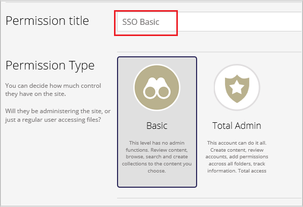
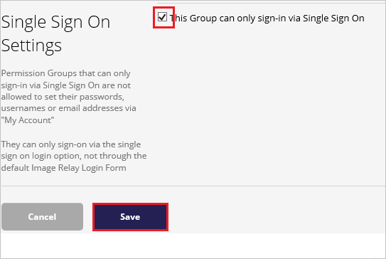
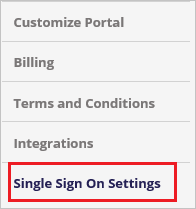
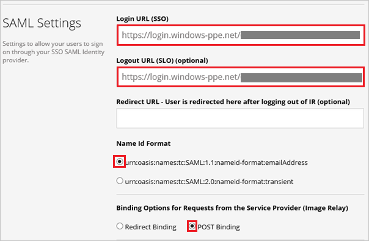
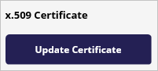
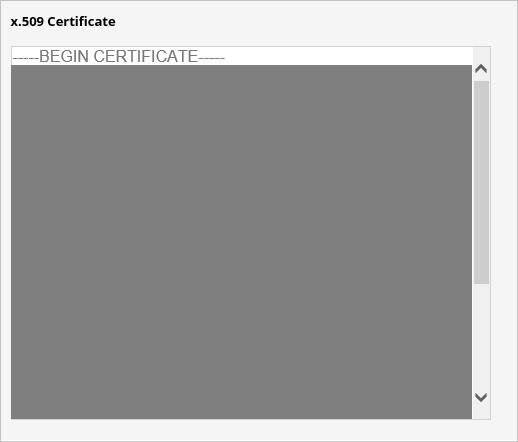
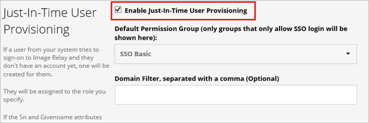
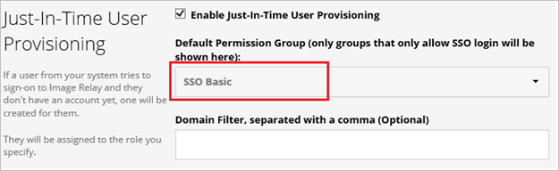

## Prerequisites

To configure Azure AD integration with Image Relay, you need the following items:

- An Azure AD subscription
- An Image Relay single sign-on enabled subscription

> **Note:**
> To test the steps in this tutorial, we do not recommend using a production environment.

To test the steps in this tutorial, you should follow these recommendations:

- Do not use your production environment, unless it is necessary.
- If you don't have an Azure AD trial environment, you can get a one-month trial [here](https://azure.microsoft.com/pricing/free-trial/).

### Configuring Image Relay for single sign-on

1. In another browser window, sign in to your Image Relay company site as an administrator.

2. In the toolbar on the top, click the **Users & Permissions** workload.
   
     

3. Click **Create New Permission**.
   
    

4. In the **Single Sign On Settings** workload, select the **This Group can only sign-in via Single Sign On** check box, and then click **Save**.
   
     

5. Go to **Account Settings**.
   
     

6. Go to the **Single Sign On Settings** workload.
    
     

7. On the **SAML Settings** dialog, perform the following steps:
    
	
    
    a. In **Login URL** textbox, paste the value of **Azure AD Single Sign-On Service URL** : %metadata:singleSignOnServiceUrl% which you have copied from Azure portal.

    b. In **Logout URL**  textbox, paste the value of **Azure AD Sign Out URL** : %metadata:singleSignOutServiceUrl% which you have copied from Azure portal.

    c. As **Name Id Format**, select **urn:oasis:names:tc:SAML:1.1:nameid-format:emailAddress**.

    d. As **Binding Options for Requests from the Service Provider (Image Relay)**, select **POST Binding**.

    e. Under **x.509 Certificate**, click **Update Certificate**.

    

    f. Open the **[Downloaded Azure AD Signing Certificate (Base64 encoded)](%metadata:certificateDownloadBase64Url%)** in notepad, copy the content, and then paste it into the x.509 Certificate textbox.

    

    g. In **Just-In-Time User Provisioning** section, select the **Enable Just-In-Time User Provisioning**.

    

    h. Select the permission group (for example, **SSO Basic**) which is allowed to sign in only through single sign-on.

    

    i. Click **Save**.

## Quick Reference

* **Azure AD Single Sign-On Service URL** : %metadata:singleSignOnServiceUrl%

* **Azure AD Sign Out URL** : %metadata:singleSignOutServiceUrl%

* **Azure AD SAML Entity ID** : %metadata:IssuerUri%

* **[Download Azure AD Signing Certificate (Base64 encoded)](%metadata:certificateDownloadBase64Url%)**

## Additional Resources

* [How to integrate Image Relay with Azure Active Directory](https://docs.microsoft.com/azure/active-directory/active-directory-saas-imagerelay-tutorial)
