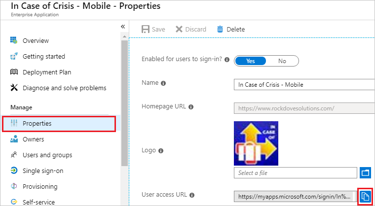

## Prerequisites

To configure Azure AD integration with In Case of Crisis - Mobile, you need the following items:

- An Azure AD subscription
- An In Case of Crisis - Mobile single sign-on enabled subscription

> **Note:**
> To test the steps in this tutorial, we do not recommend using a production environment.

To test the steps in this tutorial, you should follow these recommendations:

- Do not use your production environment, unless it is necessary.
- If you don't have an Azure AD trial environment, you can get a [free account](https://azure.microsoft.com/free/).

### Configuring In Case of Crisis - Mobile for single sign-on

1. Navigate to the **Manage** section on left side of page, click on **Properties tab** then copy the **User access URL** and save it on your computer.

	

1.  To configure single sign-on on **In Case of Crisis - Mobile** side, you need to send the **[Downloaded Azure AD Signing Certifcate](%metadata:CertificateDownloadRawUrl%)** and copied **User access URL** from Azure portal to [In Case of Crisis - Mobile support team](https://www.rockdovesolutions.com/features/enterprise-ready). They set this setting to have the SAML SSO connection set properly on both sides.

## Quick Reference

* **Login URL** : %metadata:singleSignOnServiceUrl%

* **[Download Azure AD Signing Certifcate](%metadata:CertificateDownloadRawUrl%)**

* **[Download SAML Metadata file](%metadata:metadataDownloadUrl%)**

## Additional Resources

* [How to integrate In Case of Crisis - Mobile with Azure Active Directory](https://docs.microsoft.com/azure/active-directory/saas-apps/in-case-of-crisis-mobile-tutorial)
