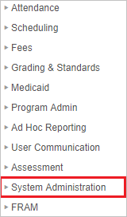
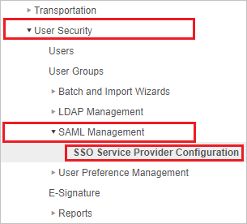
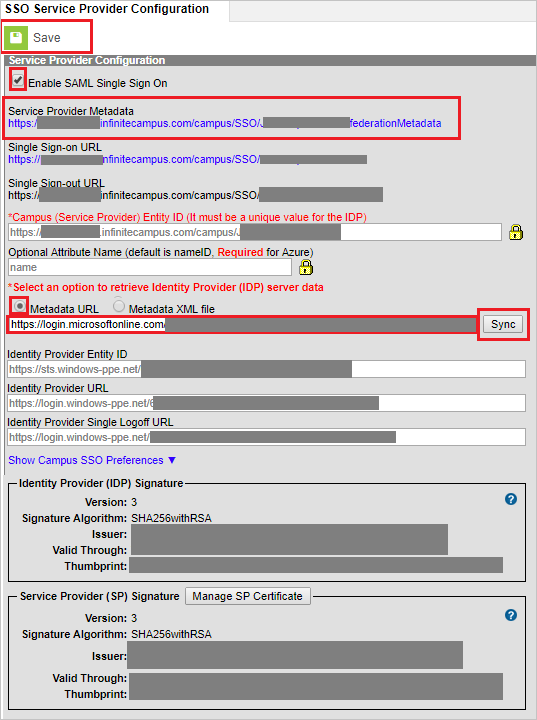

## Prerequisites

To configure Azure AD integration with Infinite Campus, you need the following items:

- An Azure AD subscription
- A Infinite Campus single sign-on enabled subscription

> **Note:**
> To test the steps in this tutorial, we do not recommend using a production environment.

To test the steps in this tutorial, you should follow these recommendations:

- Do not use your production environment, unless it is necessary.
- If you don't have an Azure AD trial environment, you can [get a one-month trial](https://azure.microsoft.com/pricing/free-trial/).

### Configuring Infinite Campus for single sign-on

1. In a different web browser window, login to Infinite Campus as a Security Administrator.

2. On the left side of menu, click **System Administration**.

	

3. Navigate to **User Security** > **SAML Management** > **SSO Service Provider Configuration**.

	

4. On the **SSO Service Provider Configuration** page, perform the following steps:

	

	a. Select **Enable SAML Single Sign On**.

	b. Click on **Service Provider Metadata** link  to save the **Service Provider metadata file** on your computer and upload it in **Basic SAML Configuration** section to auto polulate the **Identifier** and **Reply URL** values in Azure portal.

	c. On the **Select an option to retrieve Identity Provider (IDP) server data** section, select **Metadata URL** and paste the **App Federation Metadata Url** in the textbox and then click on **Sync**.

	d. After clicking **Sync** the values get auto-populated in **SSO Service Provider Configuration** page.

	e. Click **Save**.

## Quick Reference

* **Azure AD Single Sign-On Service URL** : %metadata:singleSignOnServiceUrl%

* **[Download Azure AD Signing Certifcate](%metadata:CertificateDownloadRawUrl%)**

* **[Download SAML Metadata file](%metadata:metadataDownloadUrl%)**

## Additional Resources

* [How to integrate Infinite Campus with Azure Active Directory](https://docs.microsoft.com/azure/active-directory/saas-apps/infinitecampus-tutorial)
