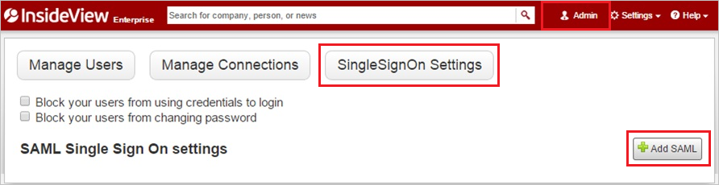
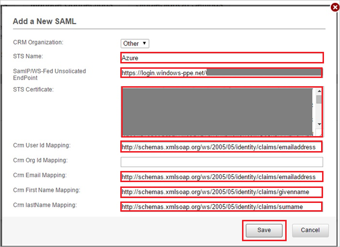

## Prerequisites

To configure Azure AD integration with insideview, you need the following items:

- An Azure AD subscription
- A insideview single sign-on enabled subscription

> **Note:**
> To test the steps in this tutorial, we do not recommend using a production environment.

To test the steps in this tutorial, you should follow these recommendations:

- Do not use your production environment, unless it is necessary.
- If you don't have an Azure AD trial environment, you can get a one-month trial [here](https://azure.microsoft.com/pricing/free-trial/).

### Configuring insideview for single sign-on

1. In a different web browser window, log in to your InsideView company site as an administrator.

2. In the toolbar on the top, click **Admin**, **SingleSignOn Settings**, and then click **Add SAML**.
   
   

3. In the **Add a New SAML** section, perform the following steps:

	
   
	a. In the **STS Name** textbox, type a name for your configuration.

	b. In **SamlP/WS-Fed Unsolicited EndPoint** textbox, paste the value of **Azure AD Single Sign-On Service URL** : %metadata:singleSignOnServiceUrl%, which you have copied from Azure portal.
	
	c. Open your **[Downloaded Azure AD Signing Certifcate](%metadata:CertificateDownloadRawUrl%)** from Azure portal, copy the content of it into your clipboard, and then paste it to the **STS Certificate** textbox.

	d. In the **Crm User Id Mapping** textbox, type `http://schemas.xmlsoap.org/ws/2005/05/identity/claims/emailaddress`.
		
	e. In the **Crm Email Mapping** textbox, type `http://schemas.xmlsoap.org/ws/2005/05/identity/claims/emailaddress`.

	f. In the **Crm First Name Mapping** textbox, type `http://schemas.xmlsoap.org/ws/2005/05/identity/claims/givenname`.
	
	g. In the **Crm lastName Mapping** textbox, type `http://schemas.xmlsoap.org/ws/2005/05/identity/claims/surname`.  

	h. Click **Save**.

## Quick Reference

* **Azure AD Single Sign-On Service URL** : %metadata:singleSignOnServiceUrl%

* **[Download Azure AD Signing Certifcate](%metadata:CertificateDownloadRawUrl%)**

## Additional Resources

* [How to integrate insideview with Azure Active Directory](https://docs.microsoft.com/azure/active-directory/active-directory-saas-insideview-tutorial)
