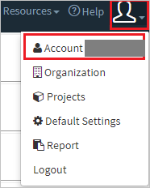
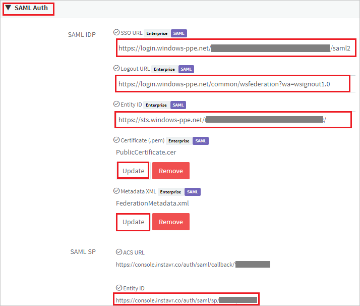

## Prerequisites

To configure Azure AD integration with InstaVR Viewer, you need the following items:

- An Azure AD subscription
- A InstaVR Viewer single sign-on enabled subscription

> **Note:**
> To test the steps in this tutorial, we do not recommend using a production environment.

To test the steps in this tutorial, you should follow these recommendations:

- Do not use your production environment, unless it is necessary.
- If you don't have an Azure AD trial environment, you can [get a one-month trial](https://azure.microsoft.com/pricing/free-trial/).

### Configuring InstaVR Viewer for single sign-on

1. Open a new web browser window and log into your InstaVR Viewer company site as an administrator.

2. Click on **User Icon** and select **Account**.

	

3. Scroll down to the **SAML Auth** and perform the following steps:

	

	a. In the **SSO URL** textbox, paste the **Login URL** : %metadata:singleSignOnServiceUrl% value, which you have copied from the Azure portal.

	b. In the **Logout URL** textbox, paste the **Logout URL** : %metadata:singleSignOutServiceUrl% value, which you have copied from the Azure portal.

	c. In the **Entity ID**  textbox, paste the **Azure Ad Identifier** : %metadata:IssuerUri% value, which you have copied from the Azure portal.

	d. To upload your **[Downloaded Azure AD Signing Certifcate (Base64 encoded)](%metadata:certificateDownloadBase64Url%)**, click **Update**.

	e. To upload your downloaded Federation Metadata file, click **Update**.

	f. Copy the **Entity ID** value and paste into the **Identifier (Entity ID)** text box on the **Basic SAML Configuration** section in the Azure portal.

## Quick Reference

* **Azure AD Single Sign-On Service URL** : %metadata:singleSignOnServiceUrl%

* **Azure AD Sign Out URL** : %metadata:singleSignOutServiceUrl%

* **Azure AD SAML Entity ID** : %metadata:IssuerUri%

* **[Download Azure AD Signing Certifcate (Base64 encoded)](%metadata:certificateDownloadBase64Url%)**

## Additional Resources

* [How to integrate InstaVR Viewer with Azure Active Directory](https://docs.microsoft.com/azure/active-directory/saas-apps/instavr-viewer-tutorial)
