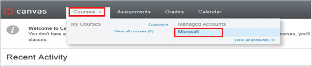
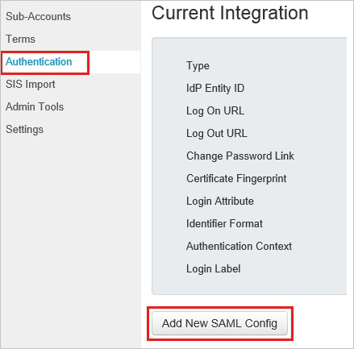
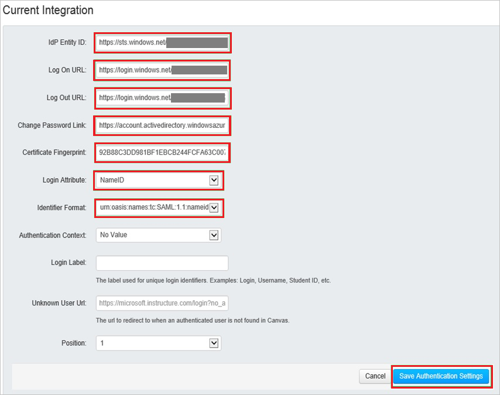

## Prerequisites

To configure Azure AD integration with Canvas, you need the following items:

- An Azure AD subscription
- A Canvas single sign-on enabled subscription

> **Note:**
> To test the steps in this tutorial, we do not recommend using a production environment.

To test the steps in this tutorial, you should follow these recommendations:

- Do not use your production environment, unless it is necessary.
- If you don't have an Azure AD trial environment, you can get a one-month trial [here](https://azure.microsoft.com/pricing/free-trial/).

### Configuring Canvas for single sign-on

7. In a different web browser window, log in to your Canvas company site as an administrator.

8. Go to **Courses \> Managed Accounts \> Microsoft**.
   
    

9. In the navigation pane on the left, select **Authentication**, and then click **Add New SAML Config**.
   
    

10. On the Current Integration page, perform the following steps:
   
    

    a. In **IdP Entity ID** textbox, enter **Azure AD SAML Entity ID** : %metadata:IssuerUri%**.

    b. In **Log On URL** textbox, enter **Azure AD Single Sign-On Service URL** : %metadata:singleSignOnServiceUrl%**.

    c. In **Log Out URL** textbox, enter **Azure AD Sign Out URL** : %metadata:singleSignOutServiceUrl%.

    d. In **Change Password Link** textbox, enter **Change Password URL:** %metadata:changePasswordUrl%. 

    e. In **Certificate Fingerprint** textbox, paste the **Thumbprint** value of [certificate](%metadata:CertificateDownloadRawUrl%) which you have copied from Azure portal.      
        
    f. From the **Login Attribute** list, select **NameID**.

    g. From the **Identifier Format** list, select **emailAddress**.

    h. Click **Save Authentication Settings**.

## Quick Reference

* **Azure AD Single Sign-On Service URL** : %metadata:singleSignOnServiceUrl%

* **Azure AD Sign Out URL** : %metadata:singleSignOutServiceUrl%'

* **Azure AD SAML Entity ID** : %metadata:IssuerUri%

* **Azure AD Change Password URL** : %metadata:changePasswordUrl%

* **[Download Azure AD Signing Certifcate](%metadata:CertificateDownloadRawUrl%)**

## Additional Resources

* [How to integrate Canvas with Azure Active Directory](https://docs.microsoft.com/en-us/azure/active-directory/active-directory-saas-canvas-lms-tutorial)
