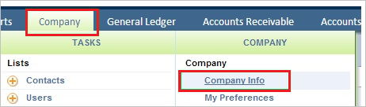
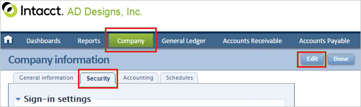
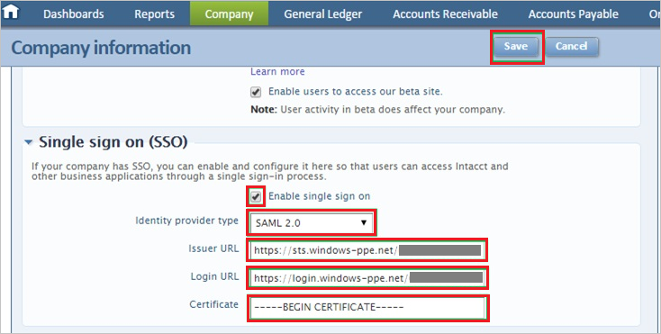

## Prerequisites

To configure Azure AD integration with Intacct, you need the following items:

- An Azure AD subscription
- A Intacct single sign-on enabled subscription

> **Note:**
> To test the steps in this tutorial, we do not recommend using a production environment.

To test the steps in this tutorial, you should follow these recommendations:

- Do not use your production environment, unless it is necessary.
- If you don't have an Azure AD trial environment, you can get a one-month trial [here](https://azure.microsoft.com/pricing/free-trial/).

### Configuring Intacct for single sign-on

1. In a different web browser window, sign in to your Intacct company site as an administrator.

2. Click the **Company** tab, and then click **Company Info**.

    

3. Click the **Security** tab, and then click **Edit**.

    

4. In the **Single sign on (SSO)** section, perform the following steps:

   	

    a. Select **Enable single sign on**.

    b. As **Identity provider type**, select **SAML 2.0**.

    c. In **Issuer URL** textbox, paste the value of **Azure AD SAML Entity ID** : %metadata:IssuerUri% which you have copied from Azure portal.
   
    d. In **Login URL** textbox, paste the value of **Azure AD Single Sign-On Service URL** : %metadata:singleSignOnServiceUrl% which you have copied from Azure portal.

    e. Open your **[Downloaded Azure AD Signing Certificate (Base64 encoded)](%metadata:certificateDownloadBase64Url%)** in notepad, copy the content of it into your clipboard, and then paste it to the **Certificate** box.
   
    f. Click **Save**.

## Quick Reference

* **Azure AD Single Sign-On Service URL** : %metadata:singleSignOnServiceUrl%

* **Azure AD SAML Entity ID** : %metadata:IssuerUri%

* **[Download Azure AD Signing Certificate (Base64 encoded)](%metadata:certificateDownloadBase64Url%)**

## Additional Resources

* [How to integrate Intacct with Azure Active Directory](https://docs.microsoft.com/azure/active-directory/active-directory-saas-intacct-tutorial)
