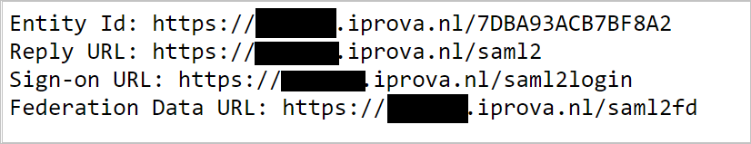
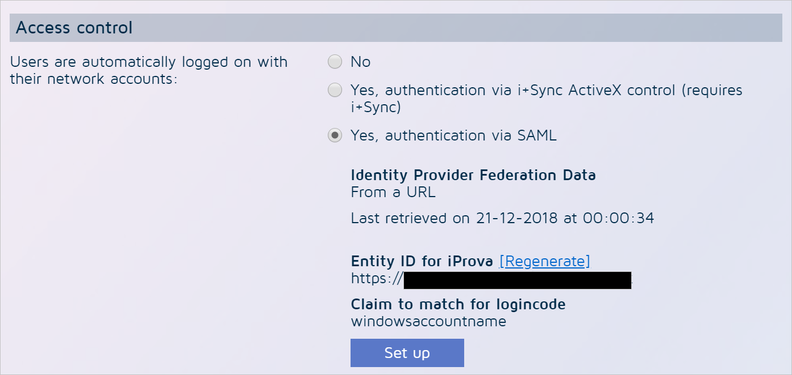
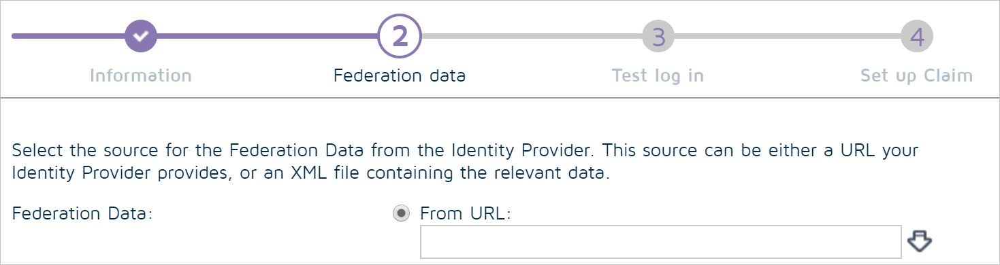

## Prerequisites

To configure Azure AD integration with iProva, you need the following items:

- An Azure AD subscription
- A iProva single sign-on enabled subscription

> **Note:**
> To test the steps in this tutorial, we do not recommend using a production environment.

To test the steps in this tutorial, you should follow these recommendations:

- Do not use your production environment, unless it is necessary.
- If you don't have an Azure AD trial environment, you can [get a one-month trial](https://azure.microsoft.com/pricing/free-trial/).

### Retrieve configuration information from iProva

In this section, you will retrieve some essential information from iProva.
You need this information in order to configure Azure AD single sign-on

1. Open a web browser and navigate to the **SAML2 info page** in iProva, using the following URL pattern:

	| | |
	|-|-|
	| `https://SUBDOMAIN.iprova.nl/saml2info`|
	| `https://SUBDOMAIN.iprova.be/saml2info`|
	| | |

	 

### Configuring iProva for single sign-on

1. Sign in to iProva using the **Administrator** account.

2. Open the **Go to** menu.

3. Click on **Application management**.

4. Click on **General** in the **System settings** panel.

5. Click on **Edit**.

6. Scroll down to **Access control**.

	

7. Find the setting **Users are automatically logged on with their network accounts**, and change it to **Yes, authentication via SAML**. Additional options will now appear.

8. Click the **Setup** button.

9. Click the **Next** button.

10. iProva will now ask you if you want to download federation data from an URL, or upload it from a file. Select the **from URL** option.

	

11. Now paste the metadata URL you saved in the last step of the **Configure Azure AD single sign-on** chapter.

12. Click the arrow-shaped button to download the metadata from Azure AD.

13. When the download is complete, the confirmation message **Valid Federation Data file downloaded** will appear.

14. Click the **Next** button.

15. Skip the **Test login** option for now, and click the **Next** button.

16. In the dropdown named **Claim to use**, select **windowsaccountname**.

17. Click the **Finish** button.

18. You now return to the **Edit general settings** screen. **Scroll down** to the bottom of the page, and click the **OK** button to save your configuration.

## Quick Reference

* **[Download Azure AD Signing Certifcate](%metadata:CertificateDownloadRawUrl%)**

* **[Download SAML Metadata file](%metadata:metadataDownloadUrl%)**

## Additional Resources

* [How to integrate iProva with Azure Active Directory](https://docs.microsoft.com/azure/active-directory/saas-apps/iprova-tutorial)
