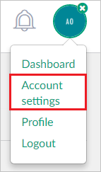
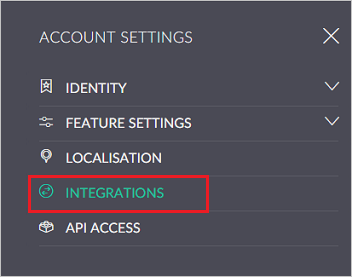
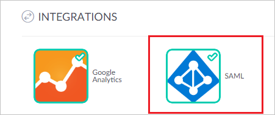
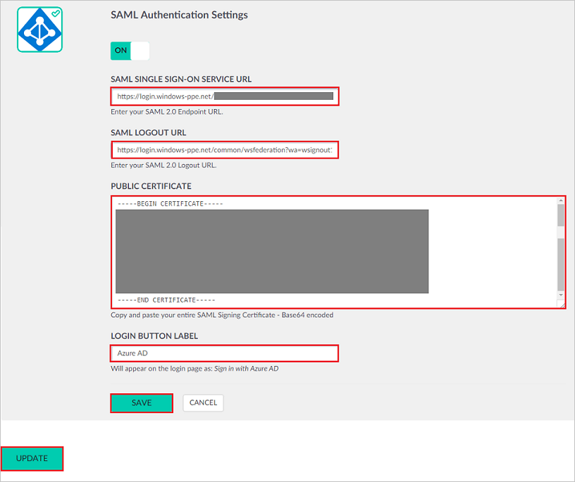

## Prerequisites

To configure Azure AD integration with iQualify LMS, you need the following items:

- An Azure AD subscription
- A iQualify LMS single sign-on enabled subscription

> **Note:**
> To test the steps in this tutorial, we do not recommend using a production environment.

To test the steps in this tutorial, you should follow these recommendations:

- Do not use your production environment, unless it is necessary.
- If you don't have an Azure AD trial environment, you can [get a one-month trial](https://azure.microsoft.com/pricing/free-trial/).

### Configuring iQualify LMS for single sign-on

1. Open a new browser window, and then sign in to your iQualify environment as an administrator.

2. Once you are logged in, click on your avatar at the top right, then click on **"Account settings."**

	 
3. In the account settings area, click on the ribbon menu on the left and click on **"INTEGRATIONS."**
	
	

4. Under INTEGRATIONS, click on the **SAML** icon.

	

5. In the **SAML Authentication Settings** dialog box, perform the following steps:

    

	a. In the **SAML SINGLE SIGN-ON SERVICE URL** box, paste the **Azure AD Single Sign-On Service URL** : %metadata:singleSignOnServiceUrl% value copied from the Azure AD application configuration window.
	
	b. In the **SAML LOGOUT URL** box, paste the **Azure AD Sign Out URL** : %metadata:singleSignOutServiceUrl% value copied from the Azure AD application configuration window.
	
	c. Open the **[Downloaded Azure AD Signing Certifcate (Base64 encoded)](%metadata:certificateDownloadBase64Url%)** in notepad, copy the content, and then paste it in the **PUBLIC CERTIFICATE** box.
	
	d. In **LOGIN BUTTON LABEL** enter the name for the button to be displayed on login page.
	
	e. Click **SAVE**.

	f. Click **UPDATE**.

## Quick Reference

* **Azure AD Single Sign-On Service URL** : %metadata:singleSignOnServiceUrl%

* **Azure AD Sign Out URL** : %metadata:singleSignOutServiceUrl%

* **[Download Azure AD Signing Certifcate (Base64 encoded)](%metadata:certificateDownloadBase64Url%)**

## Additional Resources

* [How to integrate iQualify LMS with Azure Active Directory](https://docs.microsoft.com/azure/active-directory/active-directory-saas-iqualify-tutorial)
