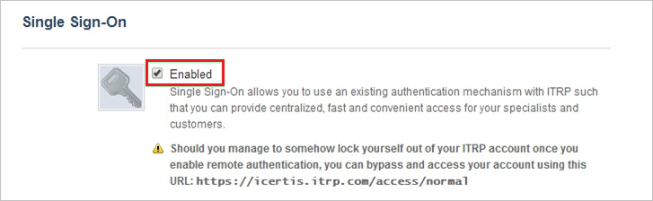
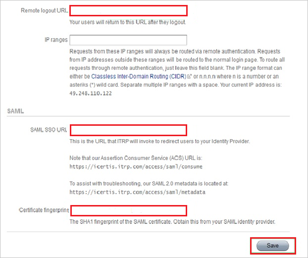

## Prerequisites

To configure Azure AD integration with itrp, you need the following items:

- An Azure AD subscription
- A itrp single sign-on enabled subscription

> **Note:**
> To test the steps in this tutorial, we do not recommend using a production environment.

To test the steps in this tutorial, you should follow these recommendations:

- Do not use your production environment, unless it is necessary.
- If you don't have an Azure AD trial environment, you can get a one-month trial [here](https://azure.microsoft.com/pricing/free-trial/).

### Configuring itrp for single sign-on

1. In a different web browser window, log in to your ITRP company site as an administrator.

2. In the toolbar on the top, click **Settings**.
   
    

3. In the left navigation pane, select **Single Sign-On**.
   
    

4. In the Single Sign-On configuration section, perform the following steps:
   
    
    
       

	a. Click **Enable**.

	b. In **Remote Log Out URL** textbox, enter **Azure AD Sign Out URL** : %metadata:singleSignOutServiceUrl%.

	c. In **SAML SSO URL** textbox, enter **Azure AD Single Sign-On Service URL** : %metadata:singleSignOnServiceUrl%.

	d.In **Certificate Fingerprint** textbox, enter **[Download Azure AD Signing Certifcate](%metadata:CertificateDownloadRawUrl%)**. 
	  
5. Click **Save**.

## Quick Reference

* **Azure AD Single Sign-On Service URL** : %metadata:singleSignOnServiceUrl%

* **Azure AD Sign Out URL** : %metadata:singleSignOutServiceUrl%

* **[Download Azure AD Signing Certifcate](%metadata:CertificateDownloadRawUrl%)**

## Additional Resources

* [How to integrate itrp with Azure Active Directory](https://docs.microsoft.com/azure/active-directory/active-directory-saas-itrp-tutorial)
