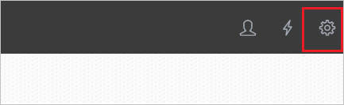
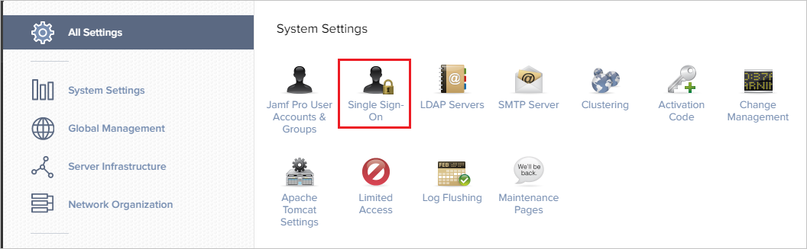
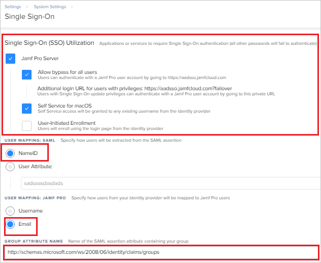
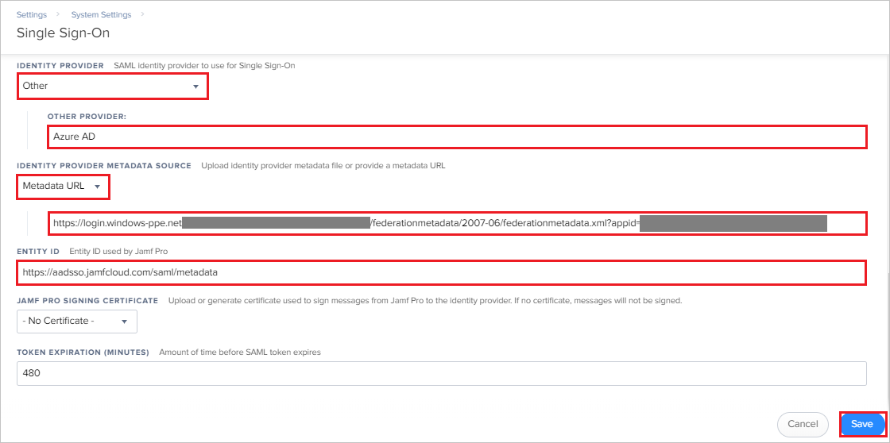

## Prerequisites

To configure Azure AD integration with Jamf Pro SAML Connector, you need the following items:

- An Azure AD subscription
- A Jamf Pro SAML Connector single sign-on enabled subscription

> **Note:**
> To test the steps in this tutorial, we do not recommend using a production environment.

To test the steps in this tutorial, you should follow these recommendations:

- Do not use your production environment, unless it is necessary.
- If you don't have an Azure AD trial environment, you can [get a one-month trial](https://azure.microsoft.com/pricing/free-trial/).

### Configuring Jamf Pro SAML Connector for single sign-on

1. In a different web browser window, log into your Jamf Pro company site as an administrator.

2. Click on the **Settings icon** from the top right corner of the page.

	

3. Click on **Single Sign On**.

	

4. On the **Single Sign-On** page perform the following steps:

	

	a. Select **Jamf Pro Server** to enable Single Sign-On access.

	b. By selecting **Allow bypass for all users** users will not be redirected to the Identity Provider login page for authentication, but can log in to Jamf Pro directly instead. When a user tries to access Jamf Pro via the Identity Provider, IdP-initiated SSO authentication and authorization occurs.

	c. Select the **NameID** option for **USER MAPPING: SAML**. By default, this setting is set to **NameID** but you may define a custom attribute.

	d. Select **Email** for **USER MAPPING: JAMF PRO**. Jamf Pro maps SAML attributes sent by the IdP in the following ways: by users and by groups. When a user tries to access Jamf Pro, by default Jamf Pro gets information about the user from the Identity Provider and matches it against Jamf Pro user accounts. If the incoming user account does not exist in Jamf Pro, then group name matching occurs.

	e. Paste the value `http://schemas.microsoft.com/ws/2008/06/identity/claims/groups` in the **GROUP ATTRIBUTE NAME** textbox.

5. On the same page scroll down upto **IDENTITY PROVIDER** under the **Single Sign-On** section and perform the following steps:

	

	a. Select **Other** as a option from the **IDENTITY PROVIDER** dropdown.

	b. In the **OTHER PROVIDER** textbox, enter **Azure AD**.

	c. Select **Metadata URL** as a option from the **IDENTITY PROVIDER METADATA SOURCE** dropdown and in the following textbox, paste the **App Federation Metadata Url** value which you have copied from the Azure portal.

	d. Copy the **Entity ID** value and paste it into the **Identifier (Entity ID)** textbox in **Jamf Pro Domain and URLs** section on Azure portal.

	> **Note:**
	> Here blurred value is the subdomain part .Use this value to complete the Sign-on URL and Reply URL in the **Jamf Pro Domain and URLs** section on Azure portal.

	e. Click **Save**.

## Quick Reference

* **[Download Azure AD Signing Certifcate](%metadata:CertificateDownloadRawUrl%)**

* **[Download SAML Metadata file](%metadata:metadataDownloadUrl%)**

## Additional Resources

* [How to integrate Jamf Pro SAML Connector with Azure Active Directory](https://docs.microsoft.com/azure/active-directory/saas-apps/jamfprosamlconnector-tutorial)
