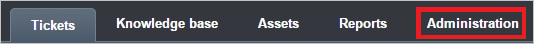
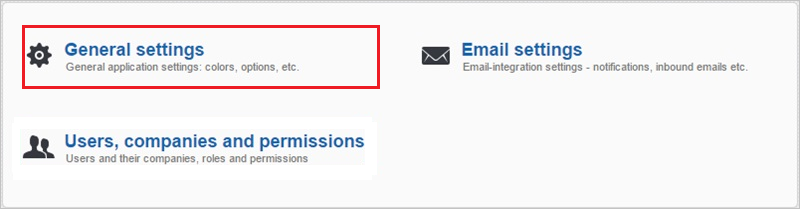
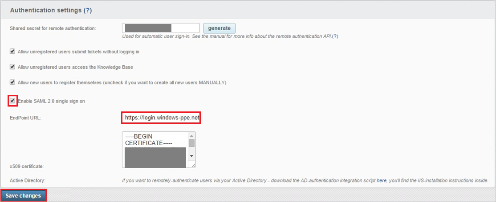

## Prerequisites

To configure Azure AD integration with Jitbit Helpdesk, you need the following items:

- An Azure AD subscription
- A Jitbit Helpdesk single sign-on enabled subscription

> **Note:**
> To test the steps in this tutorial, we do not recommend using a production environment.

To test the steps in this tutorial, you should follow these recommendations:

- Do not use your production environment, unless it is necessary.
- If you don't have an Azure AD trial environment, you can get a one-month trial [here](https://azure.microsoft.com/pricing/free-trial/).

### Configuring Jitbit Helpdesk for single sign-on

1. In a different web browser window, log into your Jitbit Helpdesk company site as an administrator.

2. In the toolbar on the top, click **Administration**.
   
    

3. Click **General settings**.
   
    

4. In the **Authentication settings** configuration section, perform the following steps:
   
    
	
	a. Select **Enable SAML 2.0 single sign on**, to sign in using Single Sign-On (SSO), with **OneLogin**.

	b. In the **EndPoint URL** textbox, paste the value of **Azure AD Single Sign-On Service URL** : %metadata:singleSignOnServiceUrl% which you have copied from Azure portal.

	c. Open your **[Downloaded Azure AD Signing Certificate (Base64 encoded)](%metadata:certificateDownloadBase64Url%)** in notepad, copy the content of it into your clipboard, and then paste it to the **X.509 Certificate** textbox

	d. Click **Save changes**.

## Quick Reference

* **Azure AD Single Sign-On Service URL** : %metadata:singleSignOnServiceUrl%

* **[Download Azure AD Signing Certificate (Base64 encoded)](%metadata:certificateDownloadBase64Url%)**

## Additional Resources

* [How to integrate Jitbit Helpdesk with Azure Active Directory](https://docs.microsoft.com/azure/active-directory/active-directory-saas-jitbit-helpdesk-tutorial)
