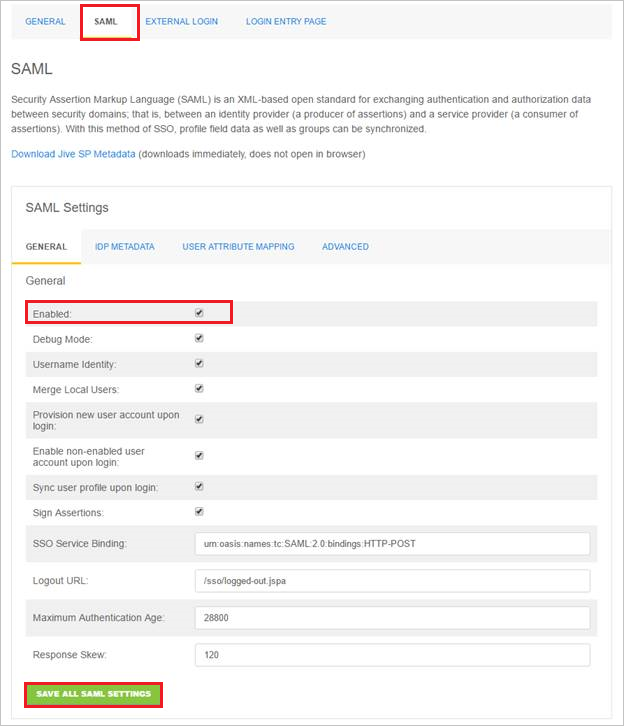
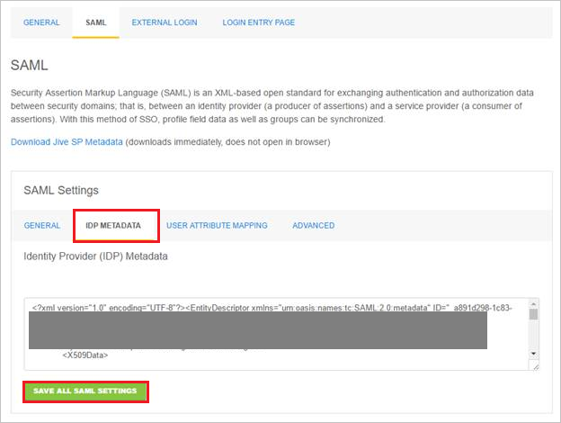
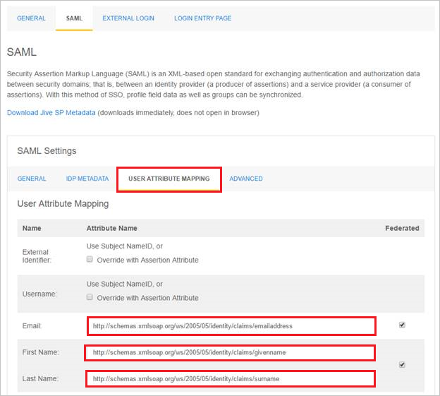

## Prerequisites

To configure Azure AD integration with Jive, you need the following items:

- An Azure AD subscription
- A Jive single-sign on enabled subscription

> [!Note]:
> To test the steps in this tutorial, we do not recommend using a production environment.

To test the steps in this tutorial, you should follow these recommendations:

- Do not use your production environment, unless it is necessary.
- If you don't have an Azure AD trial environment, you can get a one-month trial [here](https://azure.microsoft.com/pricing/free-trial/).

### Configuring Jive for single sign-on

1. To configure single sign-on on **Jive** side, sign-on to your Jive tenant as an administrator.

2. In the menu on the top, Click "**Saml**."

	

	a. Select **Enabled** under the **General** tab.   

	b. Click the "**Save all saml settings**" button.

3. Navigate to the "**Idp Metadata**" tab.
   
    
   
    a. Copy the content of the **[Download SAML Metadata file](%metadata:metadataDownloadUrl%)**, and then paste it into the **Identity Provider (IDP) Metadata** textbox.
   
    b. Click the "**Save all saml settings**" button. 

4. Go to the "**User Attribute Mapping**" tab.
   
    
   
    a. In the **Email** textbox, copy and paste the attribute name of **mail** value.
   
    b. In the **First Name** textbox, copy and paste the attribute name of **givenname** value.
   
    c. In the **Last Name** textbox, copy and paste the attribute name of **surname** value.

## Quick Reference

**[Download SAML Metadata file](%metadata:metadataDownloadUrl%)**

## Additional Resources

* [How to integrate Jive with Azure Active Directory](active-directory-saas-jive-tutorial.md)
* [How to configure user provisioning with Jive](active-directory-saas-jive-user-provisioning-tutorial.md)

