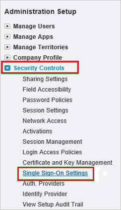
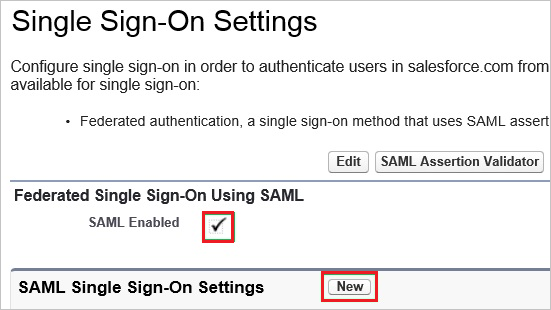
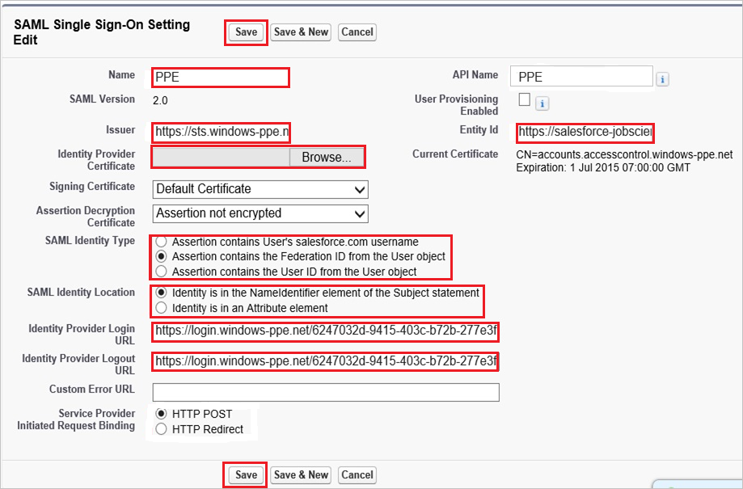
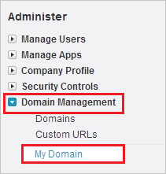
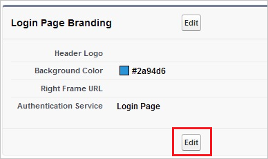
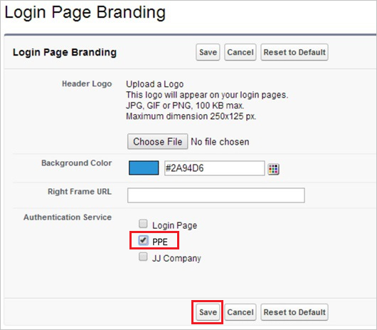

## Prerequisites

To configure Azure AD integration with jobscience, you need the following items:

- An Azure AD subscription
- A jobscience single sign-on enabled subscription

> **Note:**
> To test the steps in this tutorial, we do not recommend using a production environment.

To test the steps in this tutorial, you should follow these recommendations:

- Do not use your production environment, unless it is necessary.
- If you don't have an Azure AD trial environment, you can get a one-month trial [here](https://azure.microsoft.com/pricing/free-trial/).

### Configuring jobscience for single sign-on

1. On the Jobscience company site, click **Security Controls**, and then click **Single Sign-On Settings**.
    
    

2. In the **Single Sign-On Settings** section, perform the following steps:
    
    
    
    a. Select **SAML Enabled**.

    b. Click **New**.

3. On the **SAML Single Sign-On Setting Edit** dialog, perform the following steps:
    
    
    
    a. In the **Name** textbox, type a name for your configuration.

	b. In **Issuer** textbox, paste the value of **Azure AD SAML Entity ID** : %metadata:IssuerUri%, which you have copied from Azure portal.

    c. In the **Entity Id** textbox, type `https://salesforce-jobscience.com`

    d. Click **Browse** to upload your Azure AD certificate.

    e. As **SAML Identity Type**, select **Assertion contains the Federation ID from the User object**.

    f. As **SAML Identity Location**, select **Identity is in the NameIdentfier element of the Subject statement**.

	g. In **Identity Provider Login URL** textbox, paste the value of **Azure AD Single Sign-On Service URL** : %metadata:singleSignOnServiceUrl%, which you have copied from Azure portal.

	h. In **Identity Provider Logout URL** textbox, paste the value of **Azure AD Sign Out URL** : %metadata:singleSignOutServiceUrl%, which you have copied from Azure portal.

    i. Click **Save**.

4. On the left navigation pane, in the **Administer** section, click **Domain Management** to expand the related section, and then click **My Domain** to open the **My Domain** page. 
    
    

5. On the **My Domain** page, in the **Login Page Branding** section, click **Edit**.
    
    

6. On the **Login Page Branding** page, in the **Authentication Service** section, the name of your **SAML SSO Settings** is displayed. Select it, and then click **Save**.
    
    

## Quick Reference

* **Azure AD Single Sign-On Service URL** : %metadata:singleSignOnServiceUrl%

* **Azure AD Sign Out URL** : %metadata:singleSignOutServiceUrl%

* **Azure AD SAML Entity ID** : %metadata:IssuerUri%

## Additional Resources

* [How to integrate jobscience with Azure Active Directory](https://docs.microsoft.com/azure/active-directory/active-directory-saas-jobscience-tutorial)
