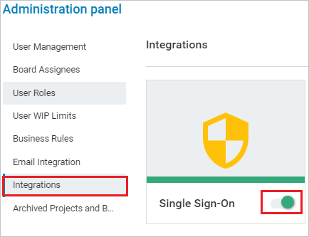
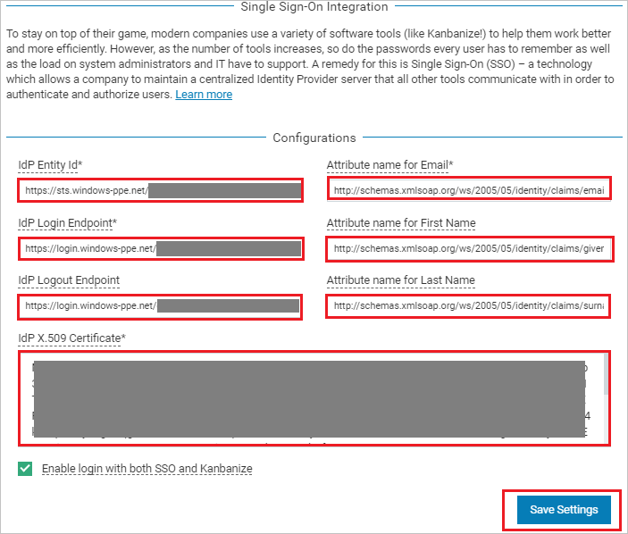

## Prerequisites

To configure Azure AD integration with Kanbanize, you need the following items:

- An Azure AD subscription
- A Kanbanize single sign-on enabled subscription

> **Note:**
> To test the steps in this tutorial, we do not recommend using a production environment.

To test the steps in this tutorial, you should follow these recommendations:

- Do not use your production environment, unless it is necessary.
- If you don't have an Azure AD trial environment, you can [get a one-month trial](https://azure.microsoft.com/pricing/free-trial/).

### Configuring Kanbanize for single sign-on

9. In a different web browser window, login to Kanbanize as a Security Administrator. 

10. Go to top  right of the page, click on **Settings** logo.

	

11. On the Administration panel page from the left side of menu click **Integrations** and then enable **Single Sign-On**. 

	

12. Under Integrations section, click on **CONFIGURE** to open **Single Sign-On Integration** page.

	

13. On the **Single Sign-On Integration** page under **Configurations**, perform the following steps:

	

	a. In the **Idp Entity Id** textbox, paste the value of **Azure AD SAML Entity ID** : %metadata:IssuerUri%, which you have copied from the Azure portal.

	b. In the **Idp Login Endpoint** textbox, paste the value of **Azure AD Single Sign-On Service URL** : %metadata:singleSignOnServiceUrl%, which you have copied from the Azure portal.

	c. In the **Idp Logout Endpoint** textbox, paste the value of **Azure AD Sign Out URL** : %metadata:singleSignOutServiceUrl%, which you have copied from the Azure portal.

	d. In **Attribute name for Email** textbox, enter this value `http://schemas.xmlsoap.org/ws/2005/05/identity/claims/emailaddress`

	e. In **Attribute name for First Name** textbox, enter this value `http://schemas.xmlsoap.org/ws/2005/05/identity/claims/givenname`

	f. In **Attribute name for Last Name** textbox, enter this value `http://schemas.xmlsoap.org/ws/2005/05/identity/claims/surname`
 
	> **Note:**
	> You can get these values by combining namespace and name values of the respective attribute from the User attributes section in Azure portal.

	g. In Notepad, open the **[Downloaded Azure AD Signing Certifcate (Base64 encoded)](%metadata:certificateDownloadBase64Url%)** from the Azure portal, copy its content (without the start and end markers), and then paste it into the **Idp X.509 Certificate** box.

	h. Check **Enable login with both SSO and Kanbanize**.
	
	i. Click **Save Settings**.

## Quick Reference

* **Azure AD Single Sign-On Service URL** : %metadata:singleSignOnServiceUrl%

* **Azure AD Sign Out URL** : %metadata:singleSignOutServiceUrl%

* **Azure AD SAML Entity ID** : %metadata:IssuerUri%

* **[Download Azure AD Signing Certifcate (Base64 encoded)](%metadata:certificateDownloadBase64Url%)**

## Additional Resources

* [How to integrate Kanbanize with Azure Active Directory](https://docs.microsoft.com/azure/active-directory/saas-apps/kanbanize-tutorial)
