## Prerequisites

To configure Azure AD integration with Kantega SSO for Bamboo, you need the following items:

- An Azure AD subscription
- A Kantega SSO for Bamboo single sign-on enabled subscription

> **Note:**
> To test the steps in this tutorial, we do not recommend using a production environment.

To test the steps in this tutorial, you should follow these recommendations:

- Do not use your production environment, unless it is necessary.
- If you don't have an Azure AD trial environment, you can [get a one-month trial](https://azure.microsoft.com/pricing/free-trial/).

### Configuring Kantega SSO for Bamboo for single sign-on

1. In a different web browser window, log in to your Bamboo  on premise server as an administrator.

2. Hover on cog and click the **Add-ons**.

	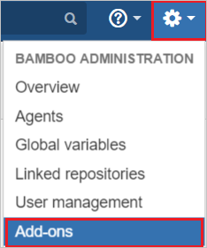

3. Under Add-ons tab section, click **Find new add-ons**. Search **Kantega SSO for Bamboo (SAML & Kerberos)** and click **Install** button to install the new SAML plugin.

	

4. The plugin installation will start.

	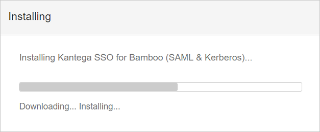

5. Once the installation is complete. Click **Close**.

	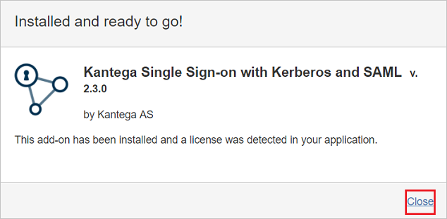

6.	Click **Manage**.

	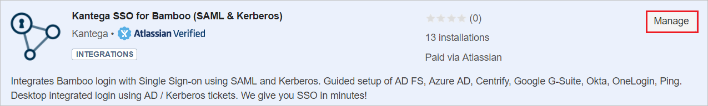
	
7. Click **Configure** to configure the new plugin.	

	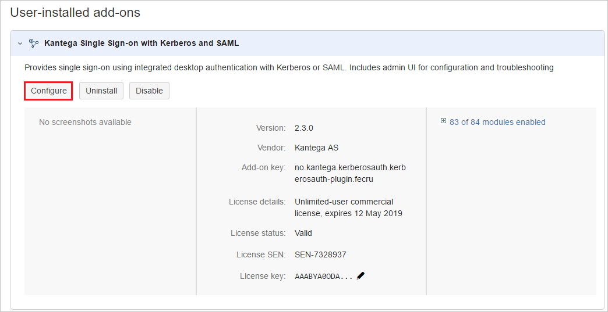

8. In the **SAML** section. Select **Azure Active Directory (Azure AD)** from the **Add identity provider** dropdown.

	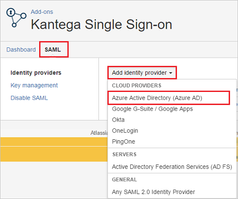

9. Select subscription level as **Basic**.

	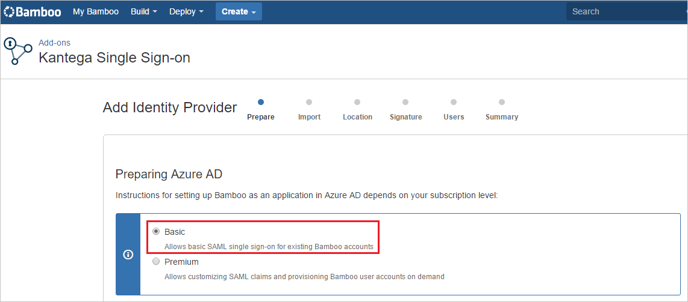

10. On the **App properties** section, perform following steps:

	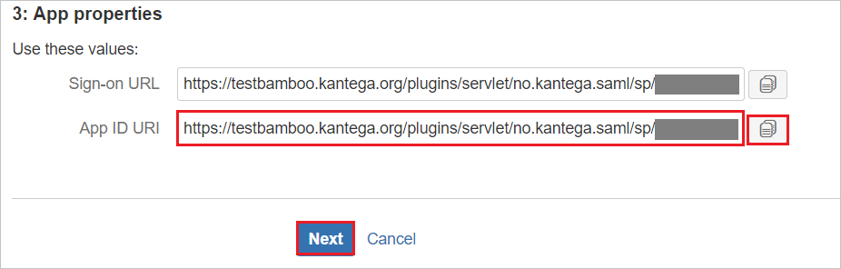

	a. Copy the **App ID URI** value and use it as **Identifier, Reply URL, and Sign-On URL** on the **Kantega SSO for Bamboo Domain and URLs** section in Azure portal.

	b. Click **Next**.

11. On the **Metadata import** section, perform following steps:

	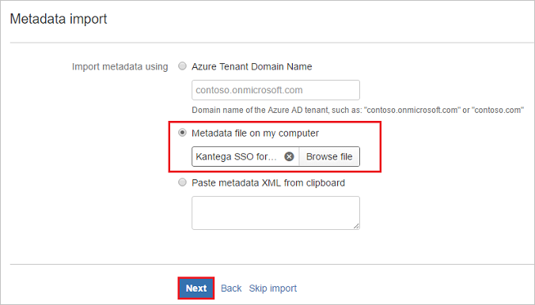

	a. Select **Metadata file on my computer**, and upload metadata file, which you have **[Downloaded SAML Metadata file](%metadata:metadataDownloadUrl%)** from Azure portal.

	b. Click **Next**.

12. On the **Name and SSO location** section, perform following steps:

	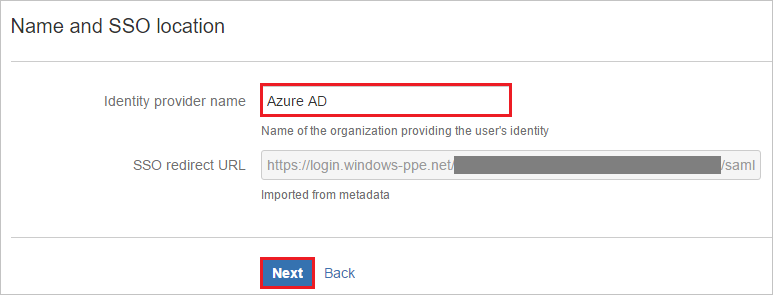

	a. Add Name of the Identity Provider in **Identity provider name** textbox (e.g Azure AD).

	b. Click **Next**.

13. Verify the Signing certificate and click **Next**.	

	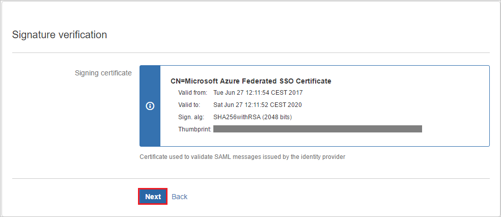

14. On the **Bamboo user accounts** section, perform following steps:

	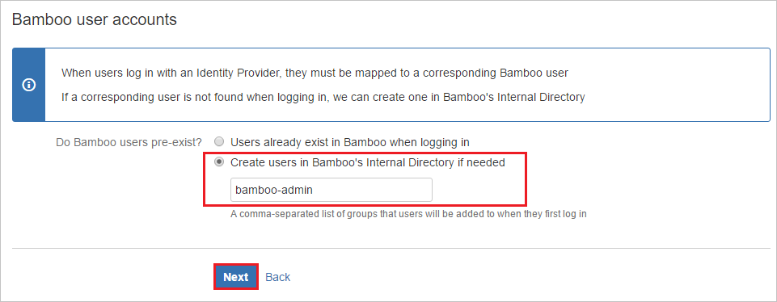

	a. Select **Create users in Bamboo's internal Directory if needed** and enter the appropriate name of the group for users (can be multiple no. of groups separated by comma).

	b. Click **Next**.

15. Click **Finish**.

	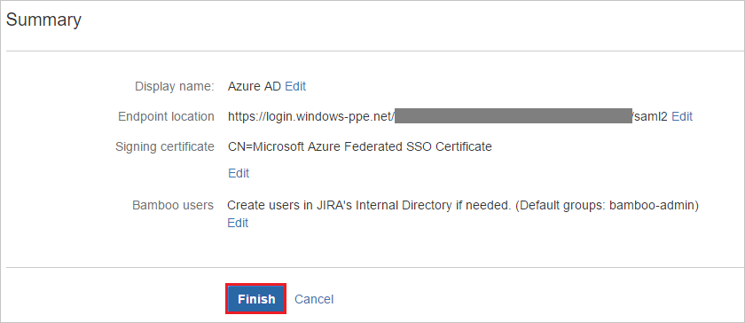

16. On the **Known domains for Azure AD** section, perform following steps:	

	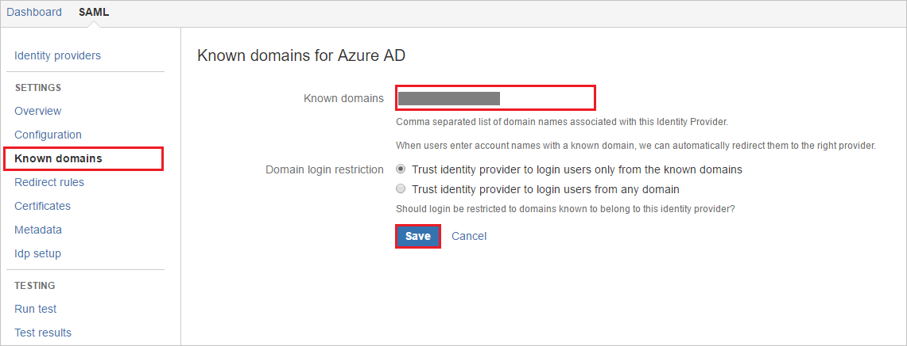

	a. Select **Known domains** from the left panel of the page.

	b. Enter domain name in the **Known domains** textbox.

	c. Click **Save**.

## Quick Reference

* **[Download SAML Metadata file](%metadata:metadataDownloadUrl%)**

## Additional Resources

* [How to integrate Kantega SSO for Bamboo with Azure Active Directory](https://docs.microsoft.com/azure/active-directory/active-directory-saas-kantegassoforbamboo-tutorial)
