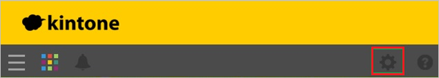

## Prerequisites

To configure Azure AD integration with Kintone, you need the following items:

- An Azure AD subscription
- A Kintone single sign-on enabled subscription

> **Note:**
> To test the steps in this tutorial, we do not recommend using a production environment.

To test the steps in this tutorial, you should follow these recommendations:

- Do not use your production environment, unless it is necessary.
- If you don't have an Azure AD trial environment, you can get a one-month trial [here](https://azure.microsoft.com/pricing/free-trial/).

### Configuring Kintone for single sign-on

1. In a different web browser window, log into your **Kintone** company site as an administrator.

2. Click **Settings**.
   
    

3. Click **Users & System Administration**.
   
    

4. Under **System Administration \> Security** click **Login**.
   
    

5. Click **Enable SAML authentication**.
   
    

6. In the SAML Authentication section, perform the following steps:
    
    
    
    a. In the **Login URL** textbox, paste the value of **Azure AD Single Sign-On Service URL** : %metadata:singleSignOnServiceUrl% which you have copied from Azure portal.
   
	b. In the **Logout URL** textbox, paste the value of **Azure AD Sign Out URL** : %metadata:singleSignOutServiceUrl% which you have copied from Azure portal.
    
	c. Click **Browse** to upload your **[Downloaded Azure AD Signing Certifcate (Base64 encoded)](%metadata:certificateDownloadBase64Url%)**.
    
	d. Click **Save**.

## Quick Reference

* **Azure AD Single Sign-On Service URL** : %metadata:singleSignOnServiceUrl%

* **Azure AD Sign Out URL** : %metadata:singleSignOutServiceUrl%

* **[Download Azure AD Signing Certifcate (Base64 encoded)](%metadata:certificateDownloadBase64Url%)**

## Additional Resources

* [How to integrate Kintone with Azure Active Directory](https://docs.microsoft.com/azure/active-directory/active-directory-saas-kintone-tutorial)
