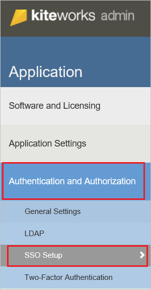
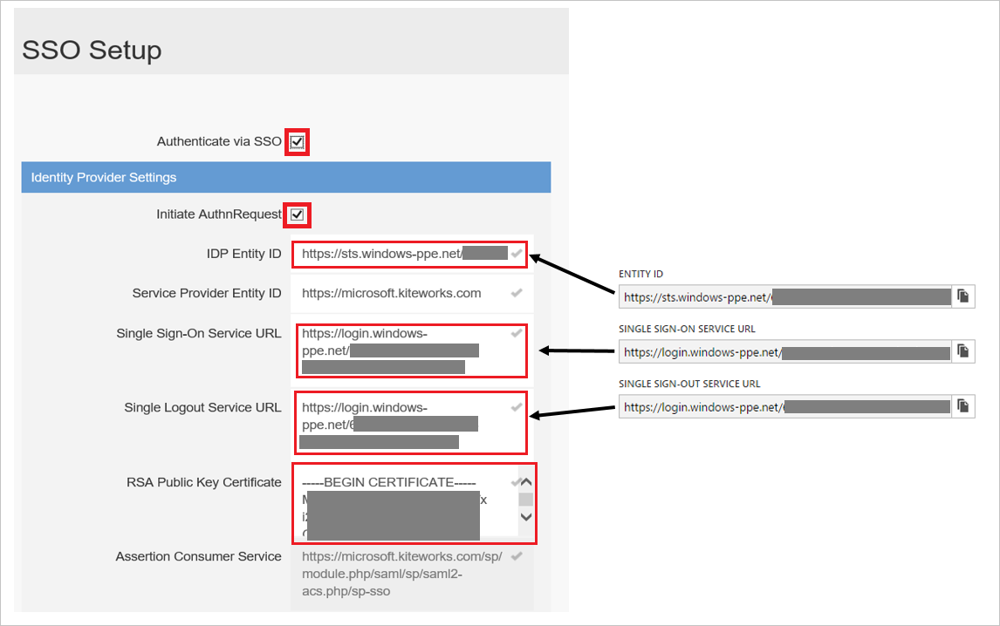

## Prerequisites

To configure Azure AD integration with Kiteworks, you need the following items:

- An Azure AD subscription
- A Kiteworks single-sign on enabled subscription

> **Note:**
> To test the steps in this tutorial, we do not recommend using a production environment.

To test the steps in this tutorial, you should follow these recommendations:

- Do not use your production environment, unless it is necessary.
- If you don't have an Azure AD trial environment, you can get a one-month trial [here](https://azure.microsoft.com/pricing/free-trial/).

### Configuring Kiteworks for single sign-on

1. Sign on to your Kiteworks company site as an administrator.

2. In the toolbar on the top, click **Settings**.
   
     

3. In the **Authentication and Authorization** section, click **SSO Setup**. 
   
    
 
4. On the SSO Setup page, perform the following steps:
   
       

    a. Select **Authenticate via SSO**.

    b. Select **Initiate AuthnRequest**.

    c. In the **IDP Entity ID** textbox, paste the value of **Azure AD SAML Entity ID** : %metadata:IssuerUri%, which you have copied from Azure portal. 

    d. In the **Single Sign-On Service URL** textbox, paste the value of **Azure AD Single Sign-On Service URL** : %metadata:singleSignOnServiceUrl%, which you have copied from Azure portal.

    e. In the **Single Logout Service URL** textbox, paste the value of **Azure AD Sign Out URL** : %metadata:singleSignOutServiceUrl%, which you have copied from Azure portal.

    f. Open your **[Downloaded Azure AD Signing Certifcate (Base64 encoded)](%metadata:certificateDownloadBase64Url%)** in Notepad, copy the content, and then paste it into the **RSA Public Key Certificate** textbox.
 
    g. Click **Save**.

## Quick Reference

* **Azure AD Single Sign-On Service URL** : %metadata:singleSignOnServiceUrl%

* **Azure AD Sign Out URL** : %metadata:singleSignOutServiceUrl%

* **Azure AD SAML Entity ID** : %metadata:IssuerUri%

* **[Download Azure AD Signing Certifcate (Base64 encoded)](%metadata:certificateDownloadBase64Url%)**

## Additional Resources

* [How to integrate Kiteworks with Azure Active Directory](https://docs.microsoft.com/azure/active-directory/active-directory-saas-kiteworks-tutorial)
