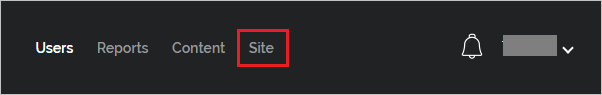
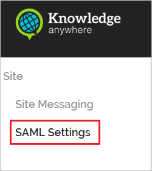
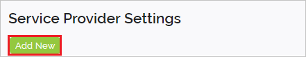
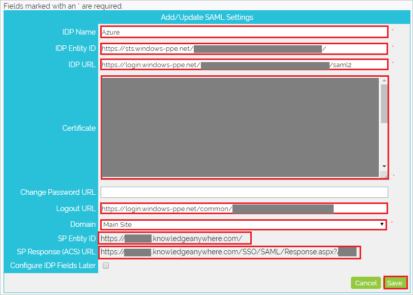

## Prerequisites

To configure Azure AD integration with Knowledge Anywhere LMS, you need the following items:

- An Azure AD subscription
- A Knowledge Anywhere LMS single sign-on enabled subscription

> **Note:**
> To test the steps in this tutorial, we do not recommend using a production environment.

To test the steps in this tutorial, you should follow these recommendations:

- Do not use your production environment, unless it is necessary.
- If you don't have an Azure AD trial environment, you can [get a one-month trial](https://azure.microsoft.com/pricing/free-trial/).

### Configuring Knowledge Anywhere LMS for single sign-on

1. In another browser window, open the Knowledge Anywhere LMS admin portal.

2. Select on the **Site** tab.

    

3. Select on the **SAML Settings** tab.

    

4. Click on the **Add New**.

    

5. On the **Add/Update SAML Settings** page, perform the following steps:

    

    a. Enter the IDP Name as per your organization. For ex:- `Azure`.

    b. In the **IDP Entity ID** textbox, paste **Azure AD Identifier** : %metadata:IssuerUri% value which you have copied from Azure portal.

    c. In the **IDP URL** textbox, paste **Azure AD Login URL** : %metadata:singleSignOnServiceUrl% value which you have copied from Azure portal.

    d. Open the **[Downloaded Azure AD Signing Certifcate (Base64 encoded)](%metadata:certificateDownloadBase64Url%)** from the Azure portal into notepad, copy the content of the certificate and paste it into **Certificate** textbox.

    e. In the **Logout URL** textbox, paste **Azure AD Logout URL** : %metadata:singleSignOutServiceUrl% value which you have copied from Azure portal.

    f. Select **Main Site** from the dropdown for the **Domain**.

    g. Copy the **SP Entity ID** value and paste it into **Identifier** text box in the **Basic SAML Configuration** section in the Azure portal.

    h. Copy the **SP Response(ACS) URL** value and paste it into **Reply URL** text box in the **Basic SAML Configuration** section in the Azure portal.

    i. Click **Save**.

## Quick Reference

* **Azure AD Login URL** : %metadata:singleSignOnServiceUrl%

* **Azure AD Logout URL** : %metadata:singleSignOutServiceUrl%

* **Azure AD Identifier** : %metadata:IssuerUri%

* **[Download Azure AD Signing Certifcate (Base64 encoded)](%metadata:certificateDownloadBase64Url%)**

## Additional Resources

* [How to integrate Knowledge Anywhere LMS with Azure Active Directory](https://docs.microsoft.com/azure/active-directory/saas-apps/knowledge-anywhere-lms-tutorial)
