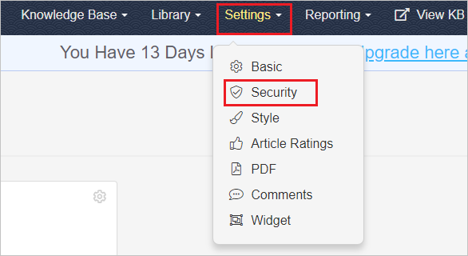
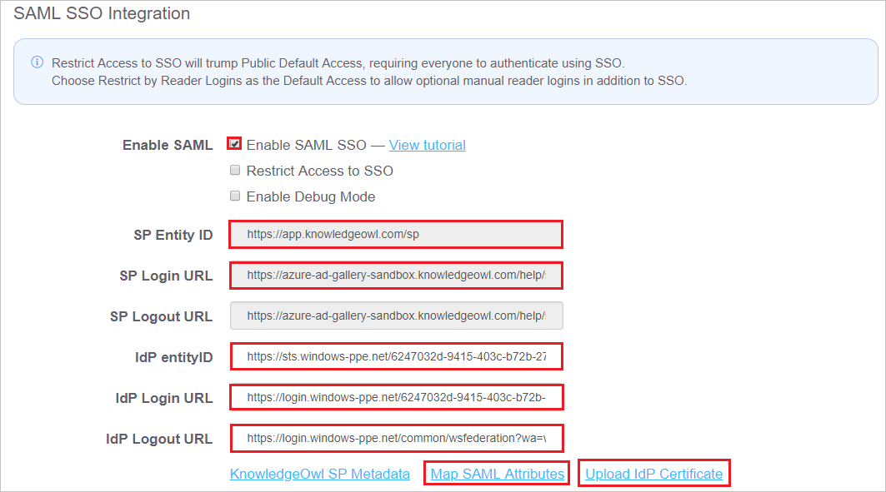
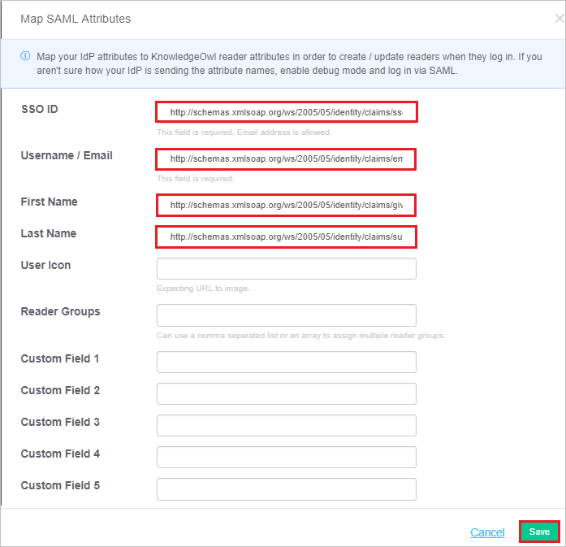
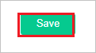

## Prerequisites

To configure Azure AD integration with KnowledgeOwl, you need the following items:

- An Azure AD subscription
- A KnowledgeOwl single sign-on enabled subscription

> **Note:**
> To test the steps in this tutorial, we do not recommend using a production environment.

To test the steps in this tutorial, you should follow these recommendations:

- Do not use your production environment, unless it is necessary.
- If you don't have an Azure AD trial environment, you can [get a one-month trial](https://azure.microsoft.com/pricing/free-trial/).

### Configuring KnowledgeOwl for single sign-on

1. In a different web browser window, log into your KnowledgeOwl company site as an administrator.

2. Click on **Settings** and then select **Security**.

	

3. Scroll down upto the **SAML SSO Integration** and perform the following steps:
	
	

	a. Select **Enable SAML SSO**.

	b. Copy the **SP Entity ID** value and paste it into the **Identifier (Entity ID)** in the **KnowledgeOwl Domain and URLs** section on the Azure portal.

	c. Copy the **SP Login URL** value and paste it into the **Sign-on URL and Reply URL** textboxes in the **KnowledgeOwl Domain and URLs** section on the Azure portal.

	d. In the **IdP entityID** textbox, paste the **Azure AD SAML Entity ID** : %metadata:IssuerUri% value, which you have copied from the Azure portal.

	e. In the **IdP Login URL** textbox, paste the **Azure AD Single Sign-On Service URL** : %metadata:singleSignOnServiceUrl% value, which you have copied from the Azure portal.

	f. In the **IdP Logout URL** textbox, paste the **Azure AD Sign Out URL** : %metadata:singleSignOutServiceUrl% value, which you have copied from the Azure portal

	g. Upload the **[Download Azure AD Signing Certifcate](%metadata:CertificateDownloadRawUrl%)** form the Azure portal by clicking the **Upload IdP Certificate**.

	h. Click on **Map SAML Attributes** to map attributes and perform the following steps:
	
	

	* Enter `http://schemas.xmlsoap.org/ws/2005/05/identity/claims/ssoid` into the **SSO ID** textbox
	* Enter `http://schemas.xmlsoap.org/ws/2005/05/identity/claims/emailaddress` into the **Username/Email** textbox.
	* Enter `http://schemas.xmlsoap.org/ws/2005/05/identity/claims/givenname` into the **First Name** textbox.
	* Enter `http://schemas.xmlsoap.org/ws/2005/05/identity/claims/surname` into the **Last Name** textbox.
	* Click **Save**

	i. Click **Save** at the bottom of the page.

	

## Quick Reference

* **Azure AD Single Sign-On Service URL** : %metadata:singleSignOnServiceUrl%

* **Azure AD Sign Out URL** : %metadata:singleSignOutServiceUrl%

* **Azure AD SAML Entity ID** : %metadata:IssuerUri%

* **[Download Azure AD Signing Certifcate](%metadata:CertificateDownloadRawUrl%)**

## Additional Resources

* [How to integrate KnowledgeOwl with Azure Active Directory](https://docs.microsoft.com/azure/active-directory/active-directory-saas-knowledgeowl-tutorial)
