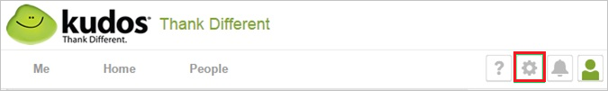
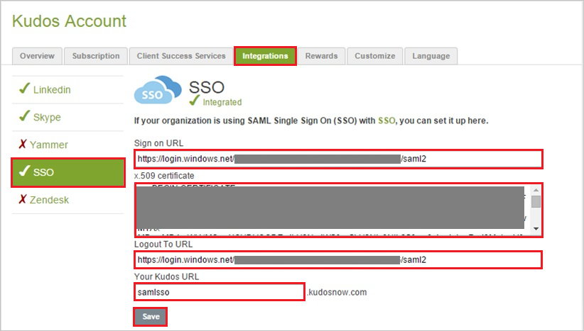

## Prerequisites

To configure Azure AD integration with Kudos, you need the following items:

- An Azure AD subscription
- A Kudos single sign-on enabled subscription

> **Note:**
> To test the steps in this tutorial, we do not recommend using a production environment.

To test the steps in this tutorial, you should follow these recommendations:

- Do not use your production environment, unless it is necessary.
- If you don't have an Azure AD trial environment, you can get a one-month trial [here](https://azure.microsoft.com/pricing/free-trial/).

### Configuring Kudos for single sign-on

1. In a different web browser window, log into your Kudos company site as an administrator.

2. In the menu on the top, click **Settings**.
   
    

3. Click **Integrations \> SSO**.

4. In the **SSO** section, perform the following steps:
   
    
   
    a. In **Sign on URL** textbox, paste the value of  **Azure AD Single Sign-On Service URL** : %metadata:singleSignOnServiceUrl%** which you have copied from Azure portal. 

    b. Open your [base-64 encoded certificate](Base64 encoded)](%metadata:certificateDownloadBase64Url%) in notepad, copy the content of it into your clipboard, and then paste it to the **X.509 certificate** textbox
   
    c. In **Logout To URL**, paste the value of  **Azure AD Sign Out URL** : %metadata:singleSignOutServiceUrl%** which you have copied from Azure portal.
   
    d. In the **Your Kudos URL** textbox, type your company name.
   
    e. Click **Save**.

## Quick Reference

* **Azure AD Single Sign-On Service URL** : %metadata:singleSignOnServiceUrl%

* **Azure AD Sign Out URL** : %metadata:singleSignOutServiceUrl%

* **[Download Azure AD Signing Certifcate (Base64 encoded)](%metadata:certificateDownloadBase64Url%)**

## Additional Resources

* [How to integrate Kudos with Azure Active Directory](https://docs.microsoft.com/azure/active-directory/active-directory-saas-kudos-tutorial)
