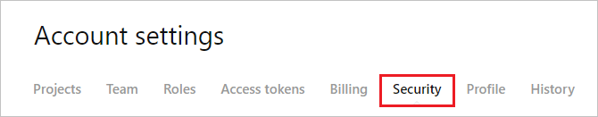

## Prerequisites

To configure Azure AD integration with LaunchDarkly, you need the following items:

- An Azure AD subscription
- A LaunchDarkly single sign-on enabled subscription

> **Note:**
> To test the steps in this tutorial, we do not recommend using a production environment.

To test the steps in this tutorial, you should follow these recommendations:

- Do not use your production environment, unless it is necessary.
- If you don't have an Azure AD trial environment, you can [get a one-month trial](https://azure.microsoft.com/pricing/free-trial/).

### Configuring LaunchDarkly for single sign-on

1. In a different web browser window, log into your LaunchDarkly company site as an administrator.

2. Select **Account Settings** from the left navigation panel.

	

3. Click **Security** tab.

	

4. Click **ENABLE SSO** and then **EDIT SAML CONFIGURATION**.

	

5. On the **Edit your SAML configuration** section, perform the following steps:

	

	a. Copy the **SAML consumer service URL** for your instance and paste it in Reply URL textbox in **LaunchDarkly Domain and URLs** section on Azure portal.

	b. In the **Sign-on URL** textbox, paste the **Azure AD Single Sign-On Service URL** : %metadata:singleSignOnServiceUrl% value, which you have copied from the Azure portal.

	c. Open the **[Downloaded Azure AD Signing Certifcate (Base64 encoded)](%metadata:certificateDownloadBase64Url%)** from the Azure portal into Notepad, copy the content and then paste it into the **X.509 certificate** box or you can directly upload the certificate by clicking the **upload one**.

	d. Click **Save**

## Quick Reference

* **Azure AD Single Sign-On Service URL** : %metadata:singleSignOnServiceUrl%

* **[Download Azure AD Signing Certifcate (Base64 encoded)](%metadata:certificateDownloadBase64Url%)**

## Additional Resources

* [How to integrate LaunchDarkly with Azure Active Directory](https://docs.microsoft.com/azure/active-directory/active-directory-saas-launchdarkly-tutorial)
