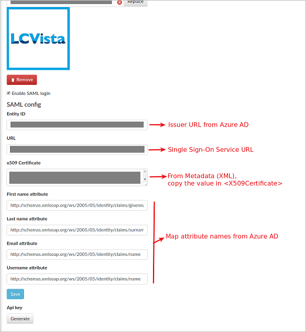

## Prerequisites

To configure Azure AD integration with LCVista, you need the following items:

- An Azure AD subscription
- A LCVista single-sign on enabled subscription

> **Note:**
> To test the steps in this tutorial, we do not recommend using a production environment.

To test the steps in this tutorial, you should follow these recommendations:

- Do not use your production environment, unless it is necessary.
- If you don't have an Azure AD trial environment, you can get a one-month trial [here](https://azure.microsoft.com/pricing/free-trial/).

### Configuring LCVista for single sign-on

1.  Sign on to your LCVista application as an administrator.

2. In the **SAML Config** section, enter the details as mentioned in below image. 

	

	a. Enter the **Azure AD SAML Entity ID**: %metadata:IssuerUri% in the **Entity ID** section. 

	b. Enter the **Azure AD Single Sign-On Service URL**: %metadata:singleSignOnServiceUrl% in the **URL** section.

	c. From Metadata (XML), copy the value **X509Certificate** and paste it in the **x509 Certificate** section.

	d. In the **First name attribute** textbox paste the value `http://schemas.xmlsoap.org/ws/2005/05/identity/claims/givenname`.

	e. In the **Last name attribute** textbox paste the value `http://schemas.xmlsoap.org/ws/2005/05/identity/claims/surname`.

	f. In the **Email attribute** textbox paste the value `http://schemas.xmlsoap.org/ws/2005/05/identity/claims/name`.

	g. In the **Username attribute** textbox paste the value `http://schemas.xmlsoap.org/ws/2005/05/identity/claims/name`.

	e. Click **Save** to save the settings.

## Quick Reference

* **Azure AD Single Sign-On Service URL**: %metadata:singleSignOnServiceUrl%

* **Azure AD SAML Entity ID**: %metadata:IssuerUri%

* **[Download SAML Metadata file](%metadata:metadataDownloadUrl%)**

## Additional Resources

* [How to integrate LCVista with Azure Active Directory](active-directory-saas-lcvista-tutorial.md)

