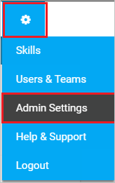
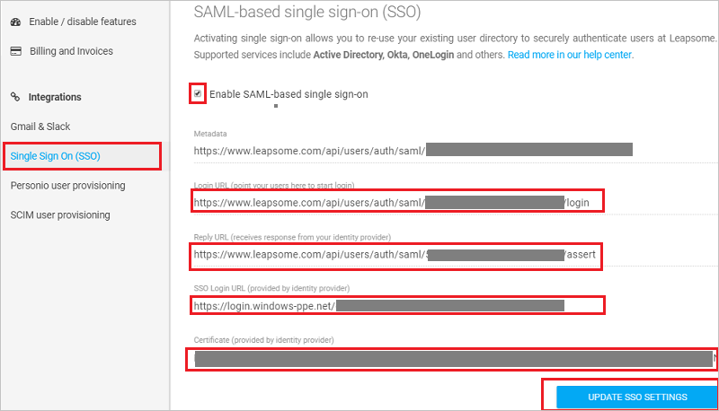

## Prerequisites

To configure Azure AD integration with Leapsome, you need the following items:

- An Azure AD subscription
- A Leapsome single sign-on enabled subscription

> **Note:**
> To test the steps in this tutorial, we do not recommend using a production environment.

To test the steps in this tutorial, you should follow these recommendations:

- Do not use your production environment, unless it is necessary.
- If you don't have an Azure AD trial environment, you can [get a one-month trial](https://azure.microsoft.com/pricing/free-trial/).

### Configuring Leapsome for single sign-on

1. In a different web browser window, log in to Leapsome as a Security Administrator.

2. On the top right, Click on Settings logo and then click **Admin Settings**. 

	

3. On the left menu bar click **Single Sign On (SSO)**, and on the **SAML-based single sign-on (SSO)** page perform the following steps:
	
	

	a. Select **Enable SAML-based single sign-on**.

	b. Copy the **Login URL (point your users here to start login)** value and paste it into the **Sign-on URL** textbox in **Leapsome Domain and URLs** section on Azure portal.

	c. Copy the **Reply URL (recieves response from your identity provider)** value and paste it into the **Reply URL** textbox in  **Leapsome Domain and URLs** section on Azure portal.

	d. In the **SSO Login URL (provided by identity provider)** textbox, paste the value of **Azure AD Single Sign-On Service URL** : %metadata:singleSignOnServiceUrl%, which you copied from the Azure portal.

	e. Copy the **[Downloaded Azure AD Signing Certifcate (Base64 encoded)](%metadata:certificateDownloadBase64Url%)** from Azure portal without --BEGIN CERTIFICATE and END CERTIFICATE-- comments and paste it in the **Certificate (provided by identity provider)** textbox.

	f. Click **UPDATE SSO SETTINGS**.

## Quick Reference

* **Azure AD Single Sign-On Service URL** : %metadata:singleSignOnServiceUrl%

* **Azure AD Sign Out URL** : %metadata:singleSignOutServiceUrl%

* **Azure AD SAML Entity ID** : %metadata:IssuerUri%

* **[Download Azure AD Signing Certifcate (Base64 encoded)](%metadata:certificateDownloadBase64Url%)**

## Additional Resources

* [How to integrate Leapsome with Azure Active Directory](https://docs.microsoft.com/azure/active-directory/saas-apps/leapsome-tutorial)
