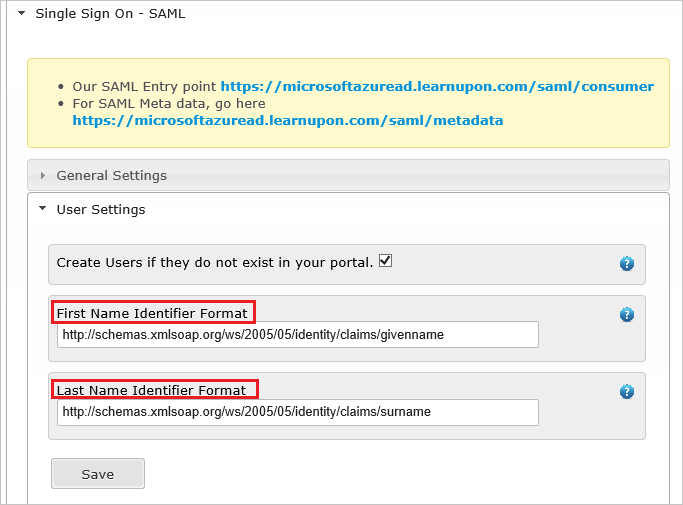

## Prerequisites

To configure Azure AD integration with LearnUpon, you need the following items:

- An Azure AD subscription
- A LearnUpon single sign-on enabled subscription

> **Note:**
> To test the steps in this tutorial, we do not recommend using a production environment.

To test the steps in this tutorial, you should follow these recommendations:

- Do not use your production environment, unless it is necessary.
- If you don't have an Azure AD trial environment, you can get a one-month trial [here](https://azure.microsoft.com/pricing/free-trial/).

### Configuring LearnUpon for single sign-on

1. Open another browser instance and login into LearnUpon with an administrator account. 

2. Click the **settings** tab.
   
    

3. Click **Single Sign On - SAML**, and then click **General Settings** to configure SAML settings.
   
     
4. In the **General Settings** section, perform the following steps:
   
       
	a. Select **Enabled**.

	b. Select **Version** as **2.0**.

	c. Select **Skip conditions** as **No**.

	d. In the **SAML Token Post param name** textbox, type the name of request post parameter to the SAML consumer URL indicated above that contains the SAML Assertion to be verified and authenticated - for example **SAMLResponse**.

	e. In the **Name Identifier Format** textbox, type the value that indicates where in your SAML Assertion the users identifier (Email address) resides - for example **urn:oasis:names:tc:SAML:1.1:nameid-format:emailAddress**.
  
	f. In the **Identify Provider Location** textbox, type the value that indicates where the users are sent to if they click on your uploaded icon from your Azure portal login screen.
  
	g. In the **Sign out URL** textbox, paste the **Azure AD Sign Out URL** : %metadata:singleSignOutServiceUrl% which you have copied from the Azure portal.
	
	h. Click **Manage finger prints**, and then upload the finger print of your **[Downloaded Azure AD Signing Certificate](%metadata:CertificateDownloadRawUrl%)**.

5. Click **User Settings**, and then perform the following steps:
   
       
 
	a. In the **First Name Identifier Format** textbox, type the value that tells us where in your SAML Assertion the users firstname resides - for example: **http://schemas.xmlsoap.org/ws/2005/05/identity/claims/givenname**.
  
	b. In the **Last Name Identifier Format** textbox, type the value that tells us where in your SAML Assertion the users lastname resides - for example: **http://schemas.xmlsoap.org/ws/2005/05/identity/claims/surname**.

## Quick Reference

* **Azure AD Sign Out URL** : %metadata:singleSignOutServiceUrl%

* **Azure AD SAML Entity ID** : %metadata:IssuerUri%

* **[Download Azure AD Signing Certificate](%metadata:CertificateDownloadRawUrl%)**

## Additional Resources

* [How to integrate LearnUpon with Azure Active Directory](https://docs.microsoft.com/azure/active-directory/active-directory-saas-learnupon-tutorial)
