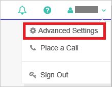

## Prerequisites

To configure Azure AD integration with Lifesize Cloud, you need the following items:

- An Azure AD subscription
- A Lifesize Cloud single sign-on enabled subscription

> **Note:**
> To test the steps in this tutorial, we do not recommend using a production environment.

To test the steps in this tutorial, you should follow these recommendations:

- Do not use your production environment, unless it is necessary.
- If you don't have an Azure AD trial environment, you can get a one-month trial [here](https://azure.microsoft.com/pricing/free-trial/).

### Configuring Lifesize Cloud for single sign-on

1. To get SSO configured for your application, login into the Lifesize Cloud application with Admin privileges.

2. In the top right corner click on your name and then click on the **Advance Settings**.
   
    

3. In the Advance Settings now click on the **SSO Configuration** link. It will open the SSO Configuration page for your instance.
   
    

4. Now configure the following values in the SSO configuration UI.    
   
    
    
	a. In **Identity Provider Issuer** textbox, paste the value of **Azure AD SAML Entity ID** : %metadata:IssuerUri% which you have copied from Azure portal.

    b.  In **Login URL** textbox, paste the value of **Azure AD Single Sign-On Service URL** : %metadata:singleSignOnServiceUrl% which you have copied from Azure portal.

    c. Open your **[Downloaded Azure AD Signing Certificate (Base64 encoded)](%metadata:certificateDownloadBase64Url%)** certificate in notepad, copy the content of it into your clipboard, and then paste it to the **X.509 Certificate** textbox.
  
    d. In the SAML Attribute mappings for the First Name text box enter the value as **http://schemas.xmlsoap.org/ws/2005/05/identity/claims/givenname**
    
	e. In the SAML Attribute mapping for the **Last Name** text box enter the value as **http://schemas.xmlsoap.org/ws/2005/05/identity/claims/surname**
    
	f. In the SAML Attribute mapping for the **Email** text box enter the value as **http://schemas.xmlsoap.org/ws/2005/05/identity/claims/emailaddress**

5. To check the configuration, you can click on the **Test** button.
   
    >[!NOTE]
    >For successful testing you need to complete the configuration wizard in Azure AD and also provide access to users or groups who can perform the test.

6. Enable the SSO by checking on the **Enable SSO** button.

7. Now click on the **Update** button so that all the settings are saved. This will generate the RelayState value. Copy the RelayState value, which is generated in the text box, paste it in the **Relay State** textbox under **Lifesize Cloud Domain and URLs** section. 

## Quick Reference

* **Azure AD Single Sign-On Service URL** : %metadata:singleSignOnServiceUrl%

* **Azure AD SAML Entity ID** : %metadata:IssuerUri%

* **[Download Azure AD Signing Certificate (Base64 encoded)](%metadata:certificateDownloadBase64Url%)**

## Additional Resources

* [How to integrate  Lifesize Cloud with Azure Active Directory](https://docs.microsoft.com/azure/active-directory/active-directory-saas-lifesize-cloud-tutorial)
