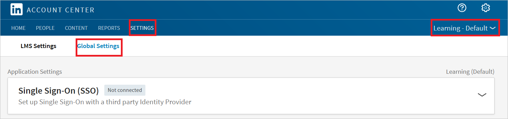
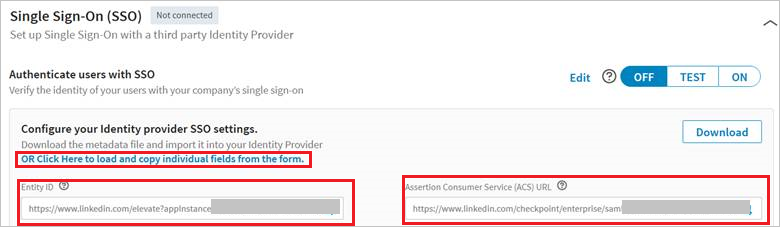
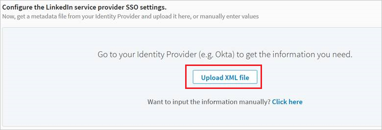
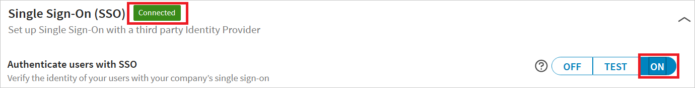

## Prerequisites

To configure Azure AD integration with Linkedin Learning, you need the following items:

- An Azure AD subscription
- A Linkedin Learning single-sign on enabled subscription

> **Note:**
> To test the steps in this tutorial, we do not recommend using a production environment.

To test the steps in this tutorial, you should follow these recommendations:

- Do not use your production environment, unless it is necessary.
- If you don't have an Azure AD trial environment, you can get a one-month trial [here](https://azure.microsoft.com/pricing/free-trial/).

### Configuring Linkedin Learning for single sign-on

1. In a different web browser window, sign-on to your LinkedIn Learning tenant as an administrator.

2. In **Account Center**, click **Global Settings** under **Settings**. Also, select **Learning - Default** from the dropdown list.

	

3. Click on **OR Click here to load and copy individual fields from the form** and copy **Entity Id** and **Assertion Consumer Access (ACS) Url**

	

4. Go to **LinkedIn Admin Settings** section. Upload the XML file you downloaded from the Azure portal by clicking the Upload XML file option.

	

5. Click **On** to enable SSO. SSO status changes from **Not Connected** to **Connected**

	

## Quick Reference

* **[Download SAML Metadata file](%metadata:metadataDownloadUrl%)**

## Additional Resources

* [How to integrate LinkedIn Learning with Azure Active Directory](active-directory-saas-linkedinlearning-tutorial.md)
