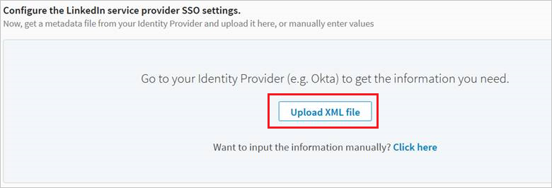
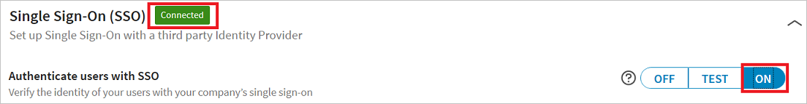

## Prerequisites

To configure Azure AD integration with LinkedIn Sales Navigator, you need the following items:

- An Azure AD subscription
- A LinkedIn Sales Navigator single-sign on enabled subscription

> [!Note]:
> To test the steps in this tutorial, we do not recommend using a production environment.

To test the steps in this tutorial, you should follow these recommendations:

- Do not use your production environment, unless it is necessary.
- If you don't have an Azure AD trial environment, you can get a one-month trial [here](https://azure.microsoft.com/pricing/free-trial/).

### Configuring LinkedIn Sales Navigator for single sign-on

1. Go to **LinkedIn Admin Settings** section. Click **Upload XML file** to upload the Metadata XML file, which you have downloaded from the Azure portal.

	

2. Click **On** to enable SSO. SSO status changes from **Not Connected** to **Connected**

	

## Quick Reference

* **Azure AD Single Sign-On Service URL**: %metadata:singleSignOnServiceUrl%

* **Azure AD Sign Out URL**: %metadata:singleSignOutServiceUrl%

* **Azure AD SAML Entity ID**: %metadata:IssuerUri%

* **[Download SAML Metadata file](%metadata:metadataDownloadUrl%)**

## Additional Resources

* [How to integrate LinkedIn Sales Navigator with Azure Active Directory](active-directory-saas-linkedinsalesnavigator-tutorial.md)

