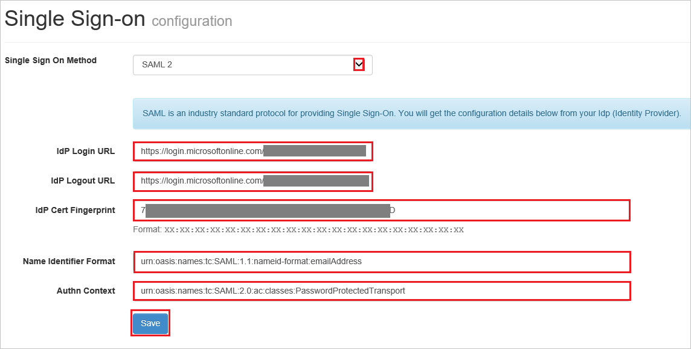

## Prerequisites

To configure Azure AD integration with LiquidFiles, you need the following items:

- An Azure AD subscription
- A LiquidFiles single sign-on enabled subscription

> **Note:**
> To test the steps in this tutorial, we do not recommend using a production environment.

To test the steps in this tutorial, you should follow these recommendations:

- Do not use your production environment, unless it is necessary.
- If you don't have an Azure AD trial environment, you can [get a one-month trial](https://azure.microsoft.com/pricing/free-trial/).

### Configuring LiquidFiles for single sign-on

1. Sign-on to your LiquidFiles company site as administrator.

2. Click **Single Sign-On** in the **Admin > Configuration** from the menu.

3. On the **Single Sign-On Configuration** page, perform the following steps

    

    a. As **Single Sign On Method**, select **SAML 2**.

	b. In the **IDP Login URL** textbox, paste the value of **Azure AD Single Sign-On Service URL** : %metadata:singleSignOnServiceUrl%, which you have copied from Azure portal.

	c. In the **IDP Logout URL** textbox, paste the value of **Azure AD Sign Out URL** : %metadata:singleSignOutServiceUrl%, which you have copied from Azure portal.

	d. In the **IDP Cert Fingerprint** textbox, paste the **THUMBPRINT** value which you have copied from Azure portal..

	e. In the Name Identifier Format textbox, type the value **urn:oasis:names:tc:SAML:1.1:nameid-format:emailAddress**.

	f. In the Authn Context textbox, type the value **urn:oasis:names:tc:SAML:2.0:ac:classes:PasswordProtectedTransport**.

	g. Click **Save**.  

## Quick Reference

* **Azure AD Single Sign-On Service URL** : %metadata:singleSignOnServiceUrl%

* **Azure AD Sign Out URL** : %metadata:singleSignOutServiceUrl%

## Additional Resources

* [How to integrate LiquidFiles with Azure Active Directory](https://docs.microsoft.com/azure/active-directory/active-directory-saas-liquidfiles-tutorial)
