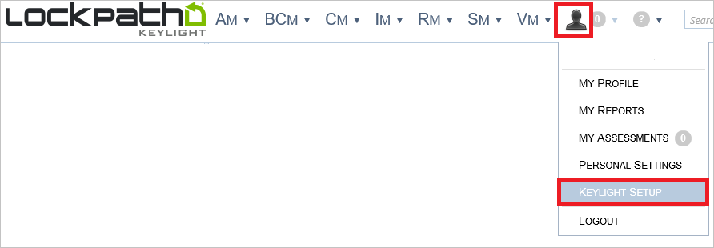

## Prerequisites

To configure Azure AD integration with LockPath Keylight, you need the following items:

- An Azure AD subscription
- A LockPath Keylight single-sign on enabled subscription

> **Note:**
> To test the steps in this tutorial, we do not recommend using a production environment.

To test the steps in this tutorial, you should follow these recommendations:

- Do not use your production environment, unless it is necessary.
- If you don't have an Azure AD trial environment, you can get a one-month trial [here](https://azure.microsoft.com/pricing/free-trial/).

### Configuring LockPath Keylight for single sign-on

1. To enable SSO in LockPath Keylight, perform the following steps:
	
	a. Sign-on to your LockPath Keylight account as administrator.
    
	b. In the menu on the top, click **Person**, and select **Keylight Setup**.
   
     

    c. In the treeview on the left, click **SAML**.
   
     

    d. On the **SAML Settings** dialog, click **Edit**.
   
     

2. On the **Edit SAML Settings** dialog page, perform the following steps:
   
    
	
	a. Set **SAML authentication** to **Active**.
    
	b. Paste the **Azure AD Single Sign-On Service URL** : %metadata:singleSignOnServiceUrl% value into the **Identity Provider Login URL** textbox.
    
	c. Paste the **Azure AD Sign Out URL** : %metadata:singleSignOutServiceUrl% value into the **Identity Provider Logout URL** textbox.
    
	d. Click **Choose File** to select your **[Download Azure AD Signing Certifcate](%metadata:CertificateDownloadRawUrl%)**, and then click **Open** to upload the certificate.
    
	e. Set **SAML User Id location** to **NameIdentifier element of the subject statement**.
    
	f. Provide the **Keylight Service Provider using the following pattern**: **https://&lt;Company Name&gt;.keylightgrc.com**.
    
	g. Set the following:
     * **Auto-provision users** to **Active**.
     * **Auto-provision account type** to **Full User**.
     * **Auto-provision security role**, select **Standard User with SAML**.
     * **Auto-provision security config**, select **Standard User Configuration**.
    
	h. Enter the following information:    
     * In the Email attribute textbox, type **http://schemas.xmlsoap.org/ws/2005/05/identity/claims/emailaddress**.
     * In the **First name attribute** textbox, type **http://schemas.xmlsoap.org/ws/2005/05/identity/claims/givenname**.
     * In the **Last name attribute** textbox, type **http://schemas.xmlsoap.org/ws/2005/05/identity/claims/surname**.
    9. Click **Save**.

## Quick Reference

* **Azure AD Single Sign-On Service URL** : %metadata:singleSignOnServiceUrl%

* **Azure AD Sign Out URL** : %metadata:singleSignOutServiceUrl%

* **Azure AD SAML Entity ID** : %metadata:IssuerUri%

* **[Download Azure AD Signing Certificate](%metadata:CertificateDownloadRawUrl%)**

## Additional Resources

* [How to integrate LockPath Keylight with Azure Active Directory](https://docs.microsoft.com/azure/active-directory/active-directory-saas-keylight-tutorial)
