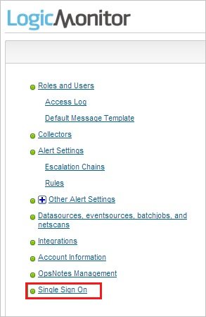
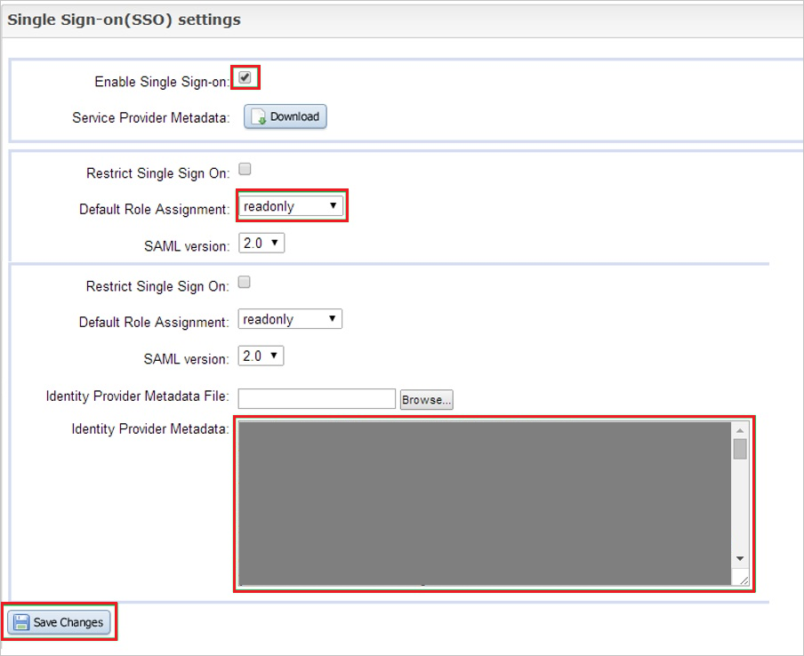

## Prerequisites

To configure Azure AD integration with LogicMonitor, you need the following items:

- An Azure AD subscription
- A LogicMonitor single-sign on enabled subscription

> **Note:**
> To test the steps in this tutorial, we do not recommend using a production environment.

To test the steps in this tutorial, you should follow these recommendations:

- Do not use your production environment, unless it is necessary.
- If you don't have an Azure AD trial environment, you can get a one-month trial [here](https://azure.microsoft.com/pricing/free-trial/).

### Configuring LogicMonitor for single sign-on

1. Log in to your **LogicMonitor** company site as an administrator.

2. In the menu on the top, click **Settings**.
   
   

3. In the navigation bat on the left side, click **Single Sign On**
   
   

4. In the **Single Sign-on (SSO) settings** section, perform the following steps:
   
   
   
   a. Select **Enable Single Sign-on**.

   b. As **Default Role Assignment**, select **readonly**.
   
   c. Open the **[Download SAML Metadata file](%metadata:metadataDownloadUrl%)** in notepad, and then paste content of the file into the **Identity Provider Metadata** textbox.
   
   d. Click **Save Changes**.

## Quick Reference

* **[Download SAML Metadata file](%metadata:metadataDownloadUrl%)**

## Additional Resources

* [How to integrate LogicMonitor with Azure Active Directory](https://docs.microsoft.com/azure/active-directory/active-directory-saas-logicmonitor-tutorial)
