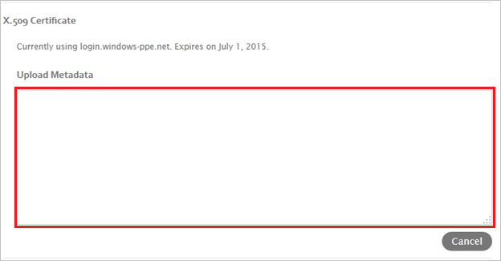

## Prerequisites

To configure Azure AD integration with Lucidchart, you need the following items:

- An Azure AD subscription
- A Lucidchart single sign-on enabled subscription

> **Note:**
> To test the steps in this tutorial, we do not recommend using a production environment.

To test the steps in this tutorial, you should follow these recommendations:

- Do not use your production environment, unless it is necessary.
- If you don't have an Azure AD trial environment, you can get a one-month trial [here](https://azure.microsoft.com/pricing/free-trial/).

### Configuring Lucidchart for single sign-on

1. In a different web browser window, log into your Lucidchart company site as an administrator.

2. In the menu on the top, click **Team**.
   
    

3. Click **Applications \> Manage SAML**.
   
    

4. On the **SAML Authentication Settings** dialog page, perform the following steps:
   
    a. Select **Enable SAML Authentication**, and then click **Optional**.

    
 
    b. In the **Domain** textbox, type your domain, and then click **Change Certificate**.

    
 
    c. Open your downloaded [metadata file](%metadata:metadataDownloadUrl%), copy the content, and then paste it into the **Upload Metadata** textbox.

    
 
    d. Select **Automatically Add new users to the team**, and then click **Save changes**.

    

## Quick Reference

* **[Download SAML Metadata file](%metadata:metadataDownloadUrl%)**

## Additional Resources

* [How to integrate Lucidchart with Azure Active Directory](https://docs.microsoft.com/azure/active-directory/active-directory-saas-lucidchart-tutorial)
