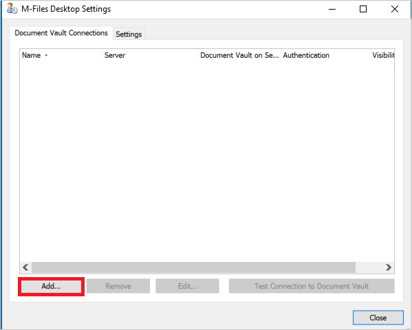
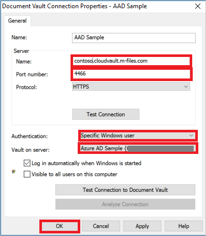

## Prerequisites

To configure Azure AD integration with M-Files, you need the following items:

- An Azure AD subscription
- A M-Files single sign-on enabled subscription

> **Note:**
> To test the steps in this tutorial, we do not recommend using a production environment.

To test the steps in this tutorial, you should follow these recommendations:

- Do not use your production environment, unless it is necessary.
- If you don't have an Azure AD trial environment, you can get a one-month trial [here](https://azure.microsoft.com/pricing/free-trial/).

### Configuring M-Files for single sign-on

1. To get SSO configured for your application, contact [M-Files support team](mailto:support@m-files.com) and provide them the **[Downloaded SAML Metadata file](%metadata:metadataDownloadUrl%)**
   
    >[!NOTE]
    >Follow the next steps if you want to configure SSO for you M-File desktop application. No extra steps are required if you only want to configure SSO for M-Files web version.  

2. Follow the next steps to configure the M-File desktop application to enable SSO with Azure AD. To download M-Files, go to [M-Files download](https://www.m-files.com/en/download-latest-version) page.

3. Open the **M-Files Desktop Settings** window. Then, click **Add**.
   
    

4. On the **Document Vault Connection Properties** window, perform the following steps:
   
      

    Under the Server section type, the values as follows:  

    a. For **Name**, type `<tenant-name>.cloudvault.m-files.com`. 
 
    b. For **Port Number**, type **4466**. 

    c. For **Protocol**, select **HTTPS**. 

    d. In the **Authentication** field, select **Specific Windows user**. Then, you are prompted with a signing page. Insert your Azure AD credentials. 

    e. For the **Vault on Server**,  select the corresponding vault on server.
 
    f. Click **OK**.

## Quick Reference

* **[Download SAML Metadata file](%metadata:metadataDownloadUrl%)**

## Additional Resources

* [How to integrate M-Files with Azure Active Directory](https://docs.microsoft.com/azure/active-directory/active-directory-saas-m-files-tutorial)
