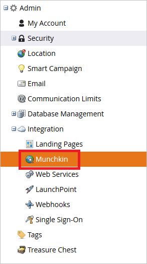
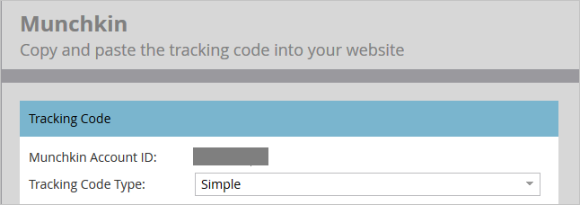
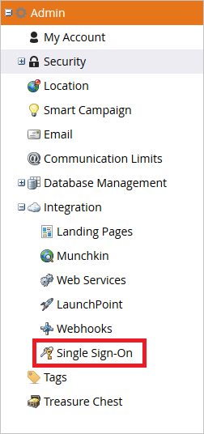

## Prerequisites

To configure Azure AD integration with Marketo, you need the following items:

- An Azure AD subscription
- A Marketo single sign-on enabled subscription

> **Note:**
> To test the steps in this tutorial, we do not recommend using a production environment.

To test the steps in this tutorial, you should follow these recommendations:

- Do not use your production environment, unless it is necessary.
- If you don't have an Azure AD trial environment, you can [get a one-month trial](https://azure.microsoft.com/pricing/free-trial/).

### Configuring Marketo for single sign-on

1. To get Munchkin Id of your application, log in to Marketo using admin credentials and perform following actions:
   
    a. Log in to Marketo app using admin credentials.
   
    b. Click the **Admin** button on the top navigation pane.
   
     
   
    c. Navigate to the Integration menu and click the **Munchkin link**.
   
    
   
    d. Copy the Munchkin Id shown on the screen and complete your Reply URL in the Azure AD configuration wizard.
   
     

2. To configure the SSO in the application, follow the below steps:
   
    a. Log in to Marketo app using admin credentials.
   
    b. Click the **Admin** button on the top navigation pane.
   
     
   
    c. Navigate to the Integration menu and click **Single Sign On**.
   
     
   
    d. To enable the SAML Settings, click **Edit** button.
   
     
   
    e. **Enabled** Single Sign-On settings.
   
    f. Paste the **Azure AD SAML Entity ID** : %metadata:IssuerUri%, in the **Issuer ID** textbox.
   
    g. In the **Entity ID** textbox, enter the URL as `http://saml.marketo.com/sp`.
   
    h. Select the User ID Location as **Name Identifier element**.
   
    
   
    > **Note:**
    > If your User Identifier is not UPN value then change the value in the Attribute tab.
   
    i. Upload the Downloaded **[Azure AD Signing Certifcate (Base64 encoded)](%metadata:certificateDownloadBase64Url%)**, which you have downloaded from Azure AD configuration wizard. **Save** the settings.
   
    j. Edit the Redirect Pages settings.
   
    k. Paste the **Azure AD Single Sign-On Service URL** : %metadata:singleSignOnServiceUrl% in the **Login URL** textbox.
   
    l. Paste the **Azure AD Sign Out URL** : %metadata:singleSignOutServiceUrl% in the **Logout URL** textbox.
   
    m. In the **Error URL**, copy your **Marketo instance URL** and click **Save** button to save settings.
   
    

3. To enable the SSO for users, complete the following actions:
   
    a. Log in to Marketo app using admin credentials.
   
    b. Click the **Admin** button on the top navigation pane.
   
     
   
    c. Navigate to the **Security** menu and click **Login Settings**.
   
    
   
    d. Check the **Require SSO** option and **Save** the settings.
   
    

## Quick Reference

* **Azure AD Single Sign-On Service URL** : %metadata:singleSignOnServiceUrl%

* **Azure AD SAML Entity ID** : %metadata:IssuerUri%

* **Azure AD Sign Out URL** : %metadata:singleSignOutServiceUrl%

* **[Download Azure AD Signing Certifcate (Base64 encoded)](%metadata:certificateDownloadBase64Url%)**

## Additional Resources

* [How to integrate Marketo with Azure Active Directory](https://docs.microsoft.com/azure/active-directory/active-directory-saas-marketo-tutorial)
