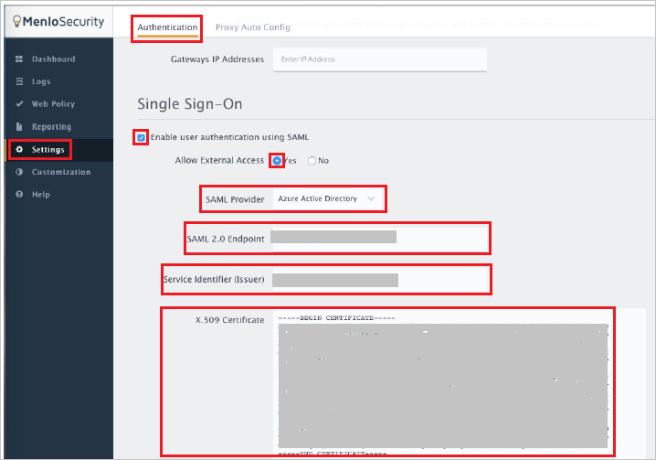

## Prerequisites

To configure Azure AD integration with Menlo Security, you need the following items:

- An Azure AD subscription
- A Menlo Security single-sign on enabled subscription

> **Note:**
> To test the steps in this tutorial, we do not recommend using a production environment.

To test the steps in this tutorial, you should follow these recommendations:

- Do not use your production environment, unless it is necessary.
- If you don't have an Azure AD trial environment, you can get a one-month trial [here](https://azure.microsoft.com/pricing/free-trial/).

### Configuring Menlo Security for single sign-on

1. To configure single sign-on on **Menlo Security** side, login to the **Menlo Security** website as an administrator.

2. Under **Settings** go to **Authentication** and perform following actions:
	
	

	a. Tick the checkbox **Enable user authentication using SAML**.

	b. Select **Allow External Access** to **Yes**.

	c. Under **SAML Provider**, select **Azure Active Directory**.

	d. **SAML 2.0 Endpoint**: Paste the **Azure AD Single Sign-On Service URL** : %metadata:singleSignOnServiceUrl% that you have copied from Azure portal.

	e. **Service Identifier (Issuer)**: Paste the **Azure AD SAML Entity ID** : %metadata:IssuerUri% that you have copied from Azure portal.

	f. **X.509 Certificate**: Open the **Certificate (Base64)** downloaded from the Azure Portal in notepad and paste its contents in this box.

	g. Click **Save** to save the settings.

## Quick Reference

* **Azure AD Single Sign-On Service URL** : %metadata:singleSignOnServiceUrl%

* **Azure AD SAML Entity ID** : %metadata:IssuerUri%

* **[Download Azure AD Signing Certificate (Base64 encoded)](%metadata:certificateDownloadBase64Url%)**

## Additional Resources

* [How to integrate Menlo Security with Azure Active Directory](active-directory-saas-menlosecurity-tutorial.md)

