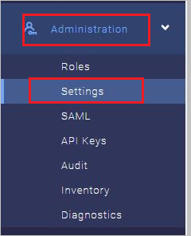
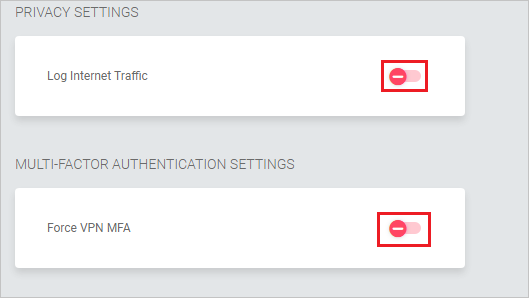
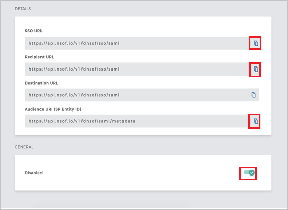
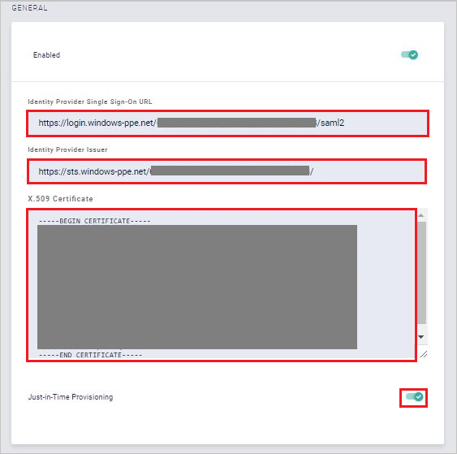

## Prerequisites

To configure Azure AD integration with Meta Networks Connector, you need the following items:

- An Azure AD subscription
- A Meta Networks Connector single sign-on enabled subscription

> **Note:**
> To test the steps in this tutorial, we do not recommend using a production environment.

To test the steps in this tutorial, you should follow these recommendations:

- Do not use your production environment, unless it is necessary.
- If you don't have an Azure AD trial environment, you can [get a one-month trial](https://azure.microsoft.com/pricing/free-trial/).

### Configuring Meta Networks Connector for single sign-on

1. Open a new tab in your browser and log in to your Meta Networks Connector administrator account.

	> **Note:**
	> Meta Networks Connector is a secure system. So before accessing their portal you need to get your public IP address whitekisted on their side. To get your public IP address,follow the below link specified [here](https://whatismyipaddress.com/). Send your IP address to the [Meta Networks Connector Client support team](mailto:support@metanetworks.com) to get your IP address whitelisted.

2. Go to **Administrator** and select **Settings**.

	

3. Make sure **Log Internet Traffic** and **Force VPN MFA** are set to off.

	

4. Go to **Administrator** and select **SAML**.

	

5. Perform the following steps on the **DETAILS** page:

	

	a. Copy **SSO URL** value and paste it into the **Sign-In URL** textbox in the **Meta Networks Connector Domain and URLs** section.

	b. Copy **Recipient URL** value and paste it into the **Reply URL** textbox in the **Meta Networks Connector Domain and URLs** section.

	c. Copy **Audience URI (SP Entity ID)** value and paste it into the **Identifier (Entity ID)** textbox in the **Meta Networks Connector Domain and URLs** section.

	d. Enable the SAML

6. On the **GENERAL** tab. perform the following steps:

	

	a. In the **Identity Provider Single Sign-On URL**, paste the **Azure AD Single Sign-On Service URL** : %metadata:singleSignOnServiceUrl% value which you have copied from the Azure portal.

	b. In the **Identity Provider Issuer**, paste the **Azure AD SAML Entity ID** : %metadata:IssuerUri% value which you have copied from the Azure portal.

	c. Open the **[Downloaded Azure AD Signing Certifcate (Base64 encoded)](%metadata:certificateDownloadBase64Url%)** from Azure portal in notepad, paste it into the **X.509 Certificate** textbox.

	d. Enable the **Just-in-Time Provisioning**.

## Quick Reference

* **Azure AD Single Sign-On Service URL** : %metadata:singleSignOnServiceUrl%

* **Azure AD SAML Entity ID** : %metadata:IssuerUri%

* **[Download Azure AD Signing Certifcate (Base64 encoded)](%metadata:certificateDownloadBase64Url%)**

## Additional Resources

* [How to integrate Meta Networks Connector with Azure Active Directory](https://docs.microsoft.com/azure/active-directory/saas-apps/metanetworksconnector-tutorial)