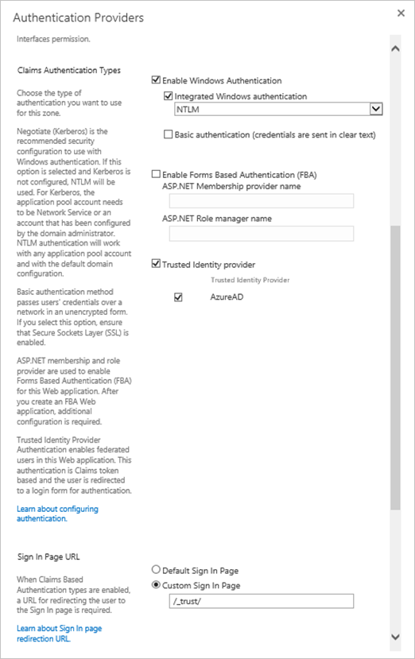

## Prerequisites

To configure Azure AD integration with SharePoint on-premises, you need the following items:

- An Azure AD subscription
- A SharePoint on-premises single sign-on enabled subscription

> **Note:**
> To test the steps in this tutorial, we do not recommend using a production environment.

To test the steps in this tutorial, you should follow these recommendations:

- Do not use your production environment, unless it is necessary.
- If you don't have an Azure AD trial environment, you can [get a one-month trial](https://azure.microsoft.com/pricing/free-trial/).

### Configuring SharePoint on-premises for single sign-on

1. In a different web browser window, log in to your SharePoint on-premises company site as an administrator.

2. **Configure a new trusted identity provider in SharePoint Server 2016**

	Sign into the SharePoint Server 2016 server and open the SharePoint 2016 Management Shell. Fill in the values of $realm, $wsfedurl, and $filepath from Azure portal and run the following commands to configure a new trusted identity provider.

	> **Tip**
	> If you're new to using PowerShell or want to learn more about how PowerShell works, see [SharePoint PowerShell](https://docs.microsoft.com/en-us/powershell/sharepoint/overview?view=sharepoint-ps). 

	```
	$realm = "<Identifier value from the SharePoint on-premises Domain and URLs section in the Azure portal>"
	$wsfedurl="<Login URL value which you have copied from the Azure portal>"
	$filepath="<Full path to SAML signing certificate file which you have copied from the Azure portal>"
	$cert = New-Object System.Security.Cryptography.X509Certificates.X509Certificate2($filepath)
	New-SPTrustedRootAuthority -Name "AzureAD" -Certificate $cert
	$map = New-SPClaimTypeMapping -IncomingClaimType "http://schemas.xmlsoap.org/ws/2005/05/identity/claims/name" -IncomingClaimTypeDisplayName "name" -LocalClaimType "http://schemas.xmlsoap.org/ws/2005/05/identity/claims/upn"
	$map2 = New-SPClaimTypeMapping -IncomingClaimType "http://schemas.xmlsoap.org/ws/2005/05/identity/claims/givenname" -IncomingClaimTypeDisplayName "GivenName" -SameAsIncoming
	$map3 = New-SPClaimTypeMapping -IncomingClaimType "http://schemas.xmlsoap.org/ws/2005/05/identity/claims/surname" -IncomingClaimTypeDisplayName "SurName" -SameAsIncoming
	$map4 = New-SPClaimTypeMapping -IncomingClaimType "http://schemas.xmlsoap.org/ws/2005/05/identity/claims/emailaddress" -IncomingClaimTypeDisplayName "Email" -SameAsIncoming
	$ap = New-SPTrustedIdentityTokenIssuer -Name "AzureAD" -Description "SharePoint secured by Azure AD" -realm $realm -ImportTrustCertificate $cert -ClaimsMappings $map,$map2,$map3 -SignInUrl $wsfedurl -IdentifierClaim "http://schemas.xmlsoap.org/ws/2005/05/identity/claims/name"
	```

	Next, follow these steps to enable the trusted identity provider for your application:

	a. In Central Administration, navigate to **Manage Web Application** and select the web application that you wish to secure with Azure AD.

	b. In the ribbon, click **Authentication Providers** and choose the zone that you wish to use.

	c. Select **Trusted Identity provider** and select the identify provider you just registered named *AzureAD*.

	d. On the sign-in page URL setting, select **Custom sign in page** and provide the value “/_trust/”.

	e. Click **OK**.

	

## Quick Reference

* **Azure AD Login URL** : %metadata:singleSignOnServiceUrl%

* **Azure AD Logout URL** : https://login.microsoftonline.com/common/wsfederation?wa=wsignout1.0

* **Azure AD Azure Ad Identifier** : %metadata:IssuerUri%

* **[Download Azure AD Signing Certifcate](%metadata:CertificateDownloadRawUrl%)**

* **[Download SAML Metadata file](%metadata:metadataDownloadUrl%)**

## Additional Resources

* [How to integrate SharePoint on-premises with Azure Active Directory](https://docs.microsoft.com/azure/active-directory/saas-apps/sharepoint-on-premises-tutorial)
