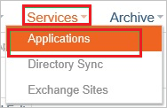
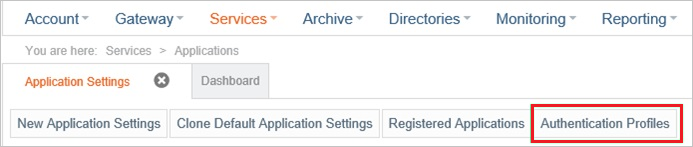
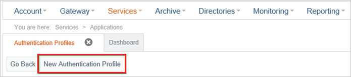
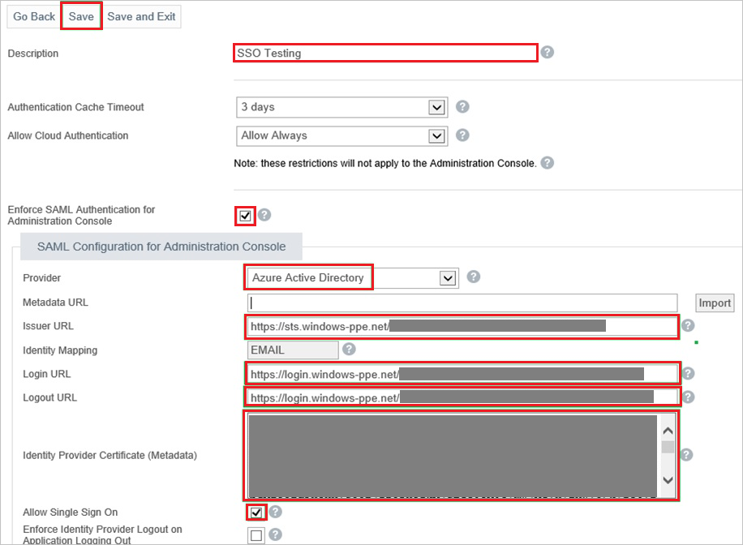

## Prerequisites

To configure Azure AD integration with Mimecast Admin Console, you need the following items:

- An Azure AD subscription
- A Mimecast Admin Console single sign-on enabled subscription

> **Note:**
> To test the steps in this tutorial, we do not recommend using a production environment.

To test the steps in this tutorial, you should follow these recommendations:

- Do not use your production environment, unless it is necessary.
- If you don't have an Azure AD trial environment, you can [get a one-month trial](https://azure.microsoft.com/pricing/free-trial/).

### Configuring Mimecast Admin Console for single sign-on

1. In a different web browser window, log into your Mimecast Admin Console as an administrator.

2. Go to **Services \> Application**.

	

3. Click **Authentication Profiles**.

	
	
4. Click **New Authentication Profile**.

	

5. In the **Authentication Profile** section, perform the following steps:

	
	
	a. In the **Description** textbox, type a name for your configuration.
	
	b. Select **Enforce SAML Authentication for Mimecast Admin Console**.
	
	c. As **Provider**, select **Azure Active Directory**.
	
	d. Paste **Azure AD SAML Entity ID** : %metadata:IssuerUri%, which you have copied from the Azure portal into the **Issuer URL** textbox.
	
	e. Paste **Azure AD Single Sign-On Service URL** : %metadata:singleSignOnServiceUrl%, which you have copied from the Azure portal into the **Login URL** textbox.

	f. Paste **Sign-Out URL**, which you have copied from the Azure portal into the **Logout URL** textbox.
	
	> **Note:**
    > The Login URL value and the Logout URL value are for the Mimecast Admin Console the same.
	
	g. Open your **[Downloaded Azure AD Signing Certifcate (Base64 encoded)](%metadata:certificateDownloadBase64Url%)** from Azure portal in notepad, remove the first line (“*--*“) and the last line (“*--*“), copy the remaining content of it into your clipboard, and then paste it to the **Identity Provider Certificate (Metadata)** textbox.
	
	h. Select **Allow Single Sign On**.
	
	i. Click **Save**.

## Quick Reference

* **Azure AD Single Sign-On Service URL** : %metadata:singleSignOnServiceUrl%

* **Azure AD SAML Entity ID** : %metadata:IssuerUri%

* **[Download Azure AD Signing Certifcate (Base64 encoded)](%metadata:certificateDownloadBase64Url%)**

## Additional Resources

* [How to integrate Mimecast Admin Console with Azure Active Directory](https://docs.microsoft.com/azure/active-directory/active-directory-saas-mimecast-admin-console-tutorial)
