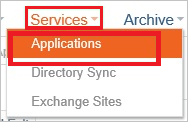
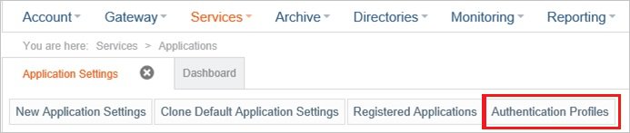
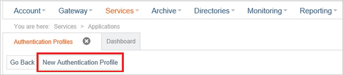
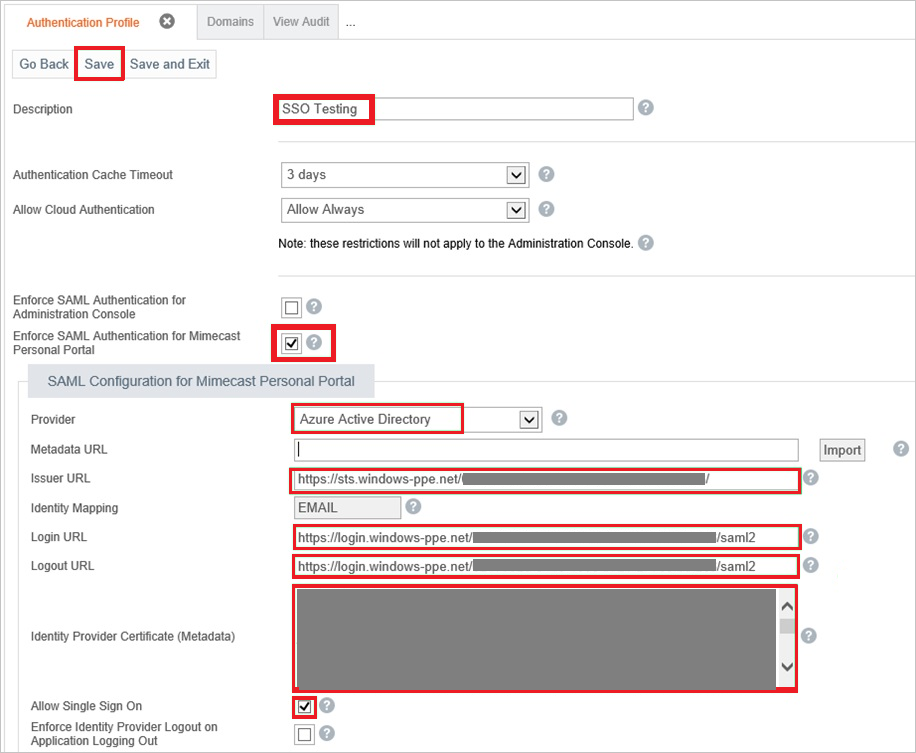

## Prerequisites

To configure Azure AD integration with Mimecast Personal Portal, you need the following items:

- An Azure AD subscription
- A Mimecast Personal Portal single sign-on enabled subscription

> **Note:**
> To test the steps in this tutorial, we do not recommend using a production environment.

To test the steps in this tutorial, you should follow these recommendations:

- Do not use your production environment, unless it is necessary.
- If you don't have an Azure AD trial environment, you can get a one-month trial here: [Trial Offer](https://azure.microsoft.com/pricing/free-trial/).

### Configuring Mimecast-Personal-Portal for single sign-on

1. In a different web browser window, log into your Mimecast Personal Portal as an administrator.

2. Go to **Services \> Applications**.
   
    

3. Click **Authentication Profiles**.
   
    

4. Click **New Authentication Profile**.
   
    

5. In the **Authentication Profile** section, perform the following steps:
   
    
   
    a. In the **Description** textbox, type a name for your configuration.
   
    b. Select **Enforce SAML Authentication for Mimecast Personal Portal**.
   
    c. As **Provider**, select **Azure Active Directory**.
   
    d. In **Issuer URL** textbox, paste the value of **Azure AD SAML Entity ID** : %metadata:IssuerUri% which you have copied from Azure portal.
   
    e. In **Login URL** textbox, paste the value of **Azure AD Single Sign-On Service URL** : %metadata:singleSignOnServiceUrl% which you have copied from Azure portal.
   
    f. In **Logout URL** textbox, paste the value of **Sign-Out URL** which you have copied from Azure portal.

	g. Open your **[Downloaded Azure AD Signing Certificate (Base64 encoded)](%metadata:certificateDownloadBase64Url%)** in notepad downloaded from Azure portal, copy the content of it into your clipboard, and then paste it to the **Identity Provider Certificate (Metadata)** textbox.

    h. Select **Allow Single Sign On**.
   
    i. Click **Save**.

## Quick Reference

* **Azure AD Single Sign-On Service URL** : %metadata:singleSignOnServiceUrl%

* **Azure AD SAML Entity ID** : %metadata:IssuerUri%

* **[Download Azure AD Signing Certificate (Base64 encoded)](%metadata:certificateDownloadBase64Url%)**

## Additional Resources

* [How to integrate Mimecast-Personal-Portal with Azure Active Directory](https://docs.microsoft.com/azure/active-directory/active-directory-saas-mimecast-personal-portal-tutorial)
