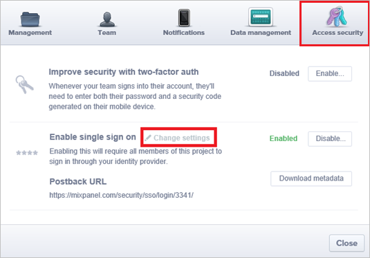
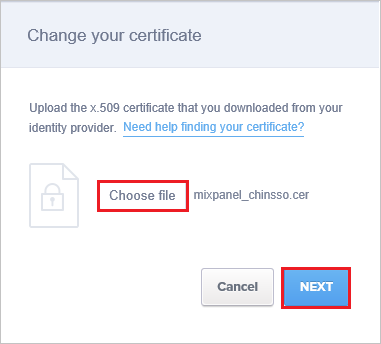

## Prerequisites

To configure Azure AD integration with Mixpanel, you need the following items:

- An Azure AD subscription
- A Mixpanel single sign-on enabled subscription

> **Note:**
> To test the steps in this tutorial, we do not recommend using a production environment.

To test the steps in this tutorial, you should follow these recommendations:

- Do not use your production environment, unless it is necessary.
- If you don't have an Azure AD trial environment, you can get a one-month trial [here](https://azure.microsoft.com/pricing/free-trial/).

### Configuring Mixpanel for single sign-on

1. In a different browser window, sign-on to your Mixpanel application as an administrator.

2. On bottom of the page, click the little **gear** icon in the left corner. 
   
     

3. Click the **Access security** tab, and then click **Change settings**.
   
     

4. On the **Change your certificate** dialog page, click **Choose file** to upload your [downloaded certificate](%metadata:certificateDownloadBase64Url%), and then click **NEXT**.
   
     

5.  In the authentication URL textbox on the **Change your authentication  URL** dialog page, paste the value of **Azure AD Single Sign-On Service URL** : %metadata:singleSignOnServiceUrl%** which you have copied from Azure portal, and then click **NEXT**.
   
     

6. Click **Done**.

## Quick Reference

* **Azure AD Single Sign-On Service URL** : %metadata:singleSignOnServiceUrl%

* **Azure AD Sign Out URL** : %metadata:singleSignOutServiceUrl%

* **Azure AD SAML Entity ID** : %metadata:IssuerUri%

* **[Download Azure AD Signing Certifcate (Base64 encoded)](%metadata:certificateDownloadBase64Url%)**

## Additional Resources

* [How to integrate Mixpanel with Azure Active Directory](https://docs.microsoft.com/azure/active-directory/active-directory-saas-mixpanel-tutorial)
