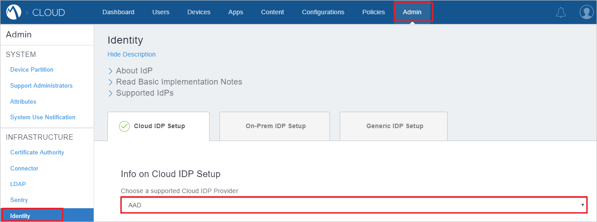
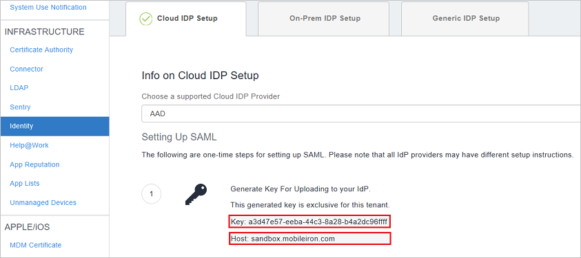
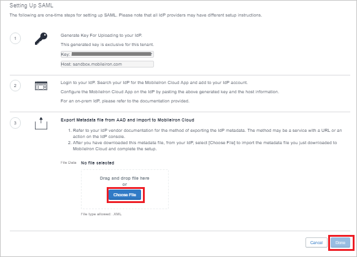

## Prerequisites

To configure Azure AD integration with MobileIron, you need the following items:

- An Azure AD subscription
- A MobileIron single sign-on enabled subscription

> **Note:**
> To test the steps in this tutorial, we do not recommend using a production environment.

To test the steps in this tutorial, you should follow these recommendations:

- Do not use your production environment, unless it is necessary.
- If you don't have an Azure AD trial environment, you can get a one-month trial [here](https://azure.microsoft.com/pricing/free-trial/).

### Configuring MobileIron for single sign-on

1. In a different web browser window, log in to your MobileIron company site as an administrator.

2. Go to **Admin** > **Identity**.

	a. Select **AAD** option in the **Info on Cloud IDP Setup** field.

    

3. Copy the values of **Key** and **Host** and paste them to complete the URLs in the **MobileIron Domain and URLs** section in Azure portal.

    

4. In the **Export​​ ​metadata​ file ​from​ ​A​AD​ and import to MobileIron Cloud Field** click **Choose File** to upload the **[SAML Metadata file](%metadata:metadataDownloadUrl%)** . Click **Done** once uploaded.
 
    

## Quick Reference

* **[Download SAML Metadata file](%metadata:metadataDownloadUrl%)**

## Additional Resources

* [How to integrate MobileIron with Azure Active Directory](https://docs.microsoft.com/azure/active-directory/active-directory-saas-mobileiron-tutorial)
