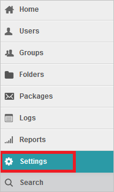
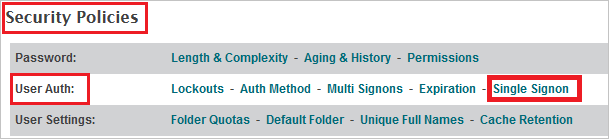
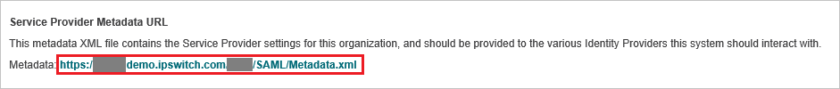
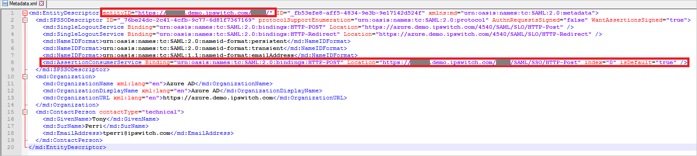
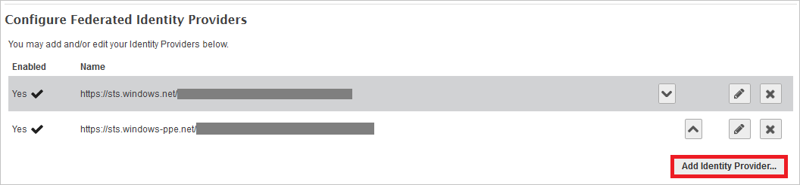
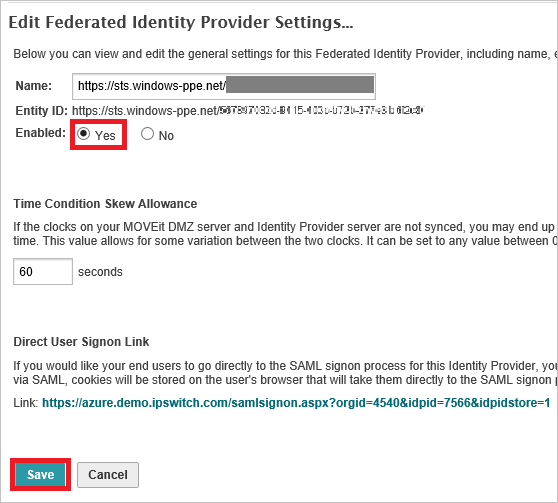
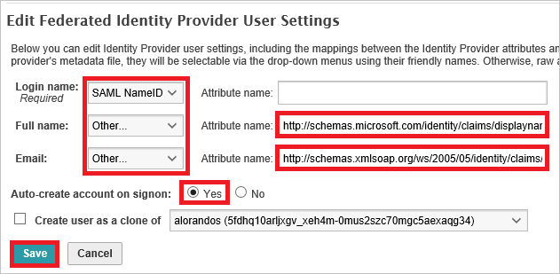

## Prerequisites

To configure Azure AD integration with MOVEit Transfer - Azure AD integration, you need the following items:

- An Azure AD subscription
- A MOVEit Transfer - Azure AD integration single sign-on enabled subscription

> **Note:**
> To test the steps in this tutorial, we do not recommend using a production environment.

To test the steps in this tutorial, you should follow these recommendations:

- Do not use your production environment, unless it is necessary.
- If you don't have an Azure AD trial environment, you can get a one-month trial here: [trail offer](https://azure.microsoft.com/pricing/free-trial/).

### Configuring MOVEit Transfer - Azure AD integration for single sign-on

1. Sign on to your MOVEit Transfer tenant as an administrator.

2. On the left navigation pane, click **Settings**.

	

3. Click **Single Signon** link, which is under **Security Policies -> User Auth**.

	

4. Click the Metadata URL link to download the metadata document.

	
	
	* Verify **entityID** matches **Identifier** in the **MOVEit Transfer - Azure AD integration Domain and URLs** section .
	* Verify **AssertionConsumerService** Location URL matches **REPLY URL** in the **MOVEit Transfer - Azure AD integration Domain and URLs** section.
	
	

5. Click **Add Identity Provider** button to add a new Federated Identity Provider.

	

6. Click **Browse...** to select the metadata file which you downloaded from Azure portal, then click **Add Identity Provider** to upload the downloaded file.

	

7. Select "**Yes**" as **Enabled** in the **Edit Federated Identity Provider Settings...** page and click **Save**.

	

8. In the **Edit Federated Identity Provider User Settings** page, perform the following actions:
	
	
	
	a. Select **SAML NameID** as **Login name**.
	
	b. Select **Other** as **Full name** and in the **Attribute name** textbox put the value: `http://schemas.microsoft.com/identity/claims/displayname`.
	
	c. Select **Other** as **Email** and in the **Attribute name** textbox put the value: `http://schemas.xmlsoap.org/ws/2005/05/identity/claims/emailaddress`.
	
	d. Select **Yes** as **Auto-create account on signon**.
	
	e. Click **Save** button.

## Quick Reference

* **[Download Azure AD Signing Certifcate](%metadata:CertificateDownloadRawUrl%)**

* **[Download SAML Metadata file](%metadata:metadataDownloadUrl%)**

## Additional Resources

* [How to integrate MOVEit Transfer - Azure AD integration with Azure Active Directory](https://docs.microsoft.com/azure/active-directory/active-directory-saas-moveittransfer-tutorial)
