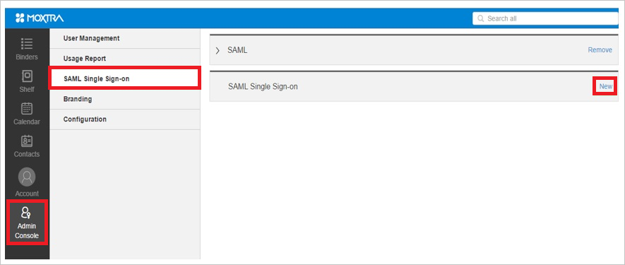
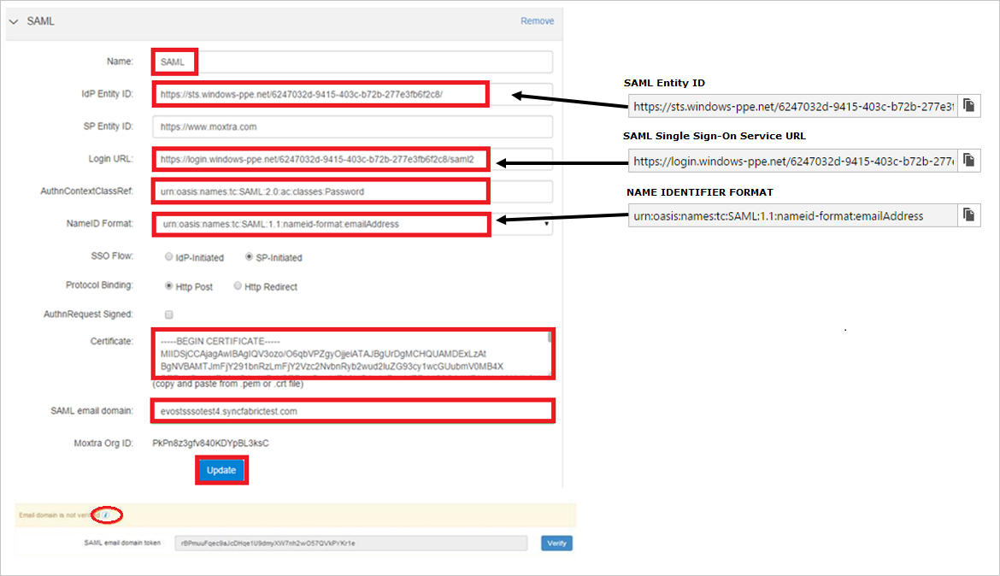

## Prerequisites

To configure Azure AD integration with Moxtra, you need the following items:

- An Azure AD subscription
- A Moxtra single sign-on enabled subscription

> **Note:**
> To test the steps in this tutorial, we do not recommend using a production environment.

To test the steps in this tutorial, you should follow these recommendations:

- Do not use your production environment, unless it is necessary.
- If you don't have an Azure AD trial environment, you can get a one-month trial [here](https://azure.microsoft.com/pricing/free-trial/).

### Configuring Moxtra for single sign-on

1. In another browser window, sign on to your Moxtra company site as an administrator.

2. In the toolbar on the left, click **Admin Console > SAML Single Sign-on**, and then click **New**.
   
     

3. On the **SAML** page, perform the following steps:
   
       
 
    a. In the **Name** textbox, type a name for your configuration (e.g.: *SAML*). 
  
    b. In the **IdP Entity ID** textbox, enter **Azure AD SAML Entity ID** : %metadata:IssuerUri%. 
 
    c. In **Login URL** textbox, enter **Azure AD Single Sign-On Service URL** : %metadata:singleSignOnServiceUrl%. 
 
    d. In the **AuthnContextClassRef** textbox, type **urn:oasis:names:tc:SAML:2.0:ac:classes:Password**. 
 
    e. In the **NameID Format** textbox, type **urn:oasis:names:tc:SAML:1.1:nameid-format:emailAddress**. 
 
    f. Open [certificate](%metadata:certificateDownloadBase64Url%) which you have downloaded from Azure portal in notepad, copy the content, and then paste it into the **Certificate** textbox.    
 
    g. In the SAML email domain textbox, type your SAML email domain.    
  
    >[!NOTE]
    >To see the steps to verify the domain, click the "**i**" below.

    h. Click **Update**.

## Quick Reference

* **Azure AD Single Sign-On Service URL** : %metadata:singleSignOnServiceUrl%

* **Azure AD SAML Entity ID** : %metadata:IssuerUri%

* **[Download Azure AD Signing Certifcate (Base64 encoded)](%metadata:certificateDownloadBase64Url%)**

## Additional Resources

* [How to integrate Moxtra with Azure Active Directory](https://docs.microsoft.com/azure/active-directory/active-directory-saas-moxtra-tutorial)
