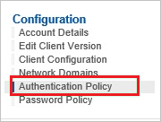
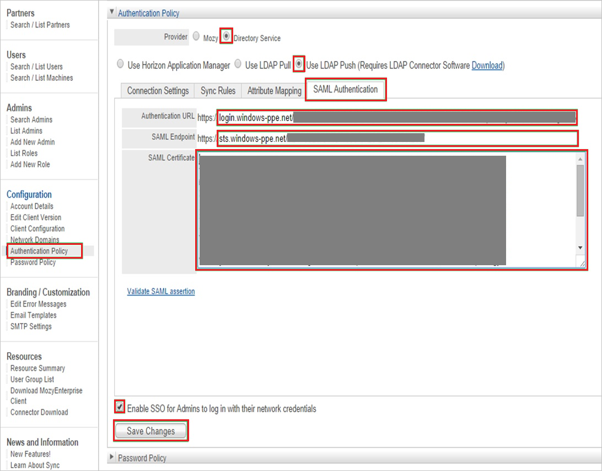

## Prerequisites

To configure Azure AD integration with Mozy Enterprise, you need the following items:

- An Azure AD subscription
- A Mozy Enterprise single sign-on enabled subscription

> **Note:**
> To test the steps in this tutorial, we do not recommend using a production environment.

To test the steps in this tutorial, you should follow these recommendations:

- Do not use your production environment, unless it is necessary.
- If you don't have an Azure AD trial environment, you can get a one-month trial [here](https://azure.microsoft.com/pricing/free-trial/).

### Configuring Mozy Enterprise for single sign-on

1. In a different web browser window, log into your Mozy Enterprise company site as an administrator.

2. In the **Configuration** section, click **Authentication Policy**.
   
   

3. On the **Authentication Policy** section, perform the following steps:
   
   
   
   a. Select **Directory Service** as **Provider**.
   
   b. Select **Use LDAP Push**.
   
   c. Click the **SAML Authentication** tab.
   
   d. Paste **Azure AD Single Sign-On Service URL** : %metadata:singleSignOnServiceUrl%
, which you have copied from the Azure portal into the **Authentication URL** textbox.
   
   e. Paste **Azure AD SAML Entity ID** : %metadata:IssuerUri%, which you have copied from the Azure portal into the **SAML Endpoint** textbox.
   
   f. Open your **[Downloaded Azure AD Signing Certifcate (Base64 encoded)](%metadata:certificateDownloadBase64Url%)** in notepad, copy the content of it into your clipboard, and then paste the entire Certificate into **SAML Certificate** textbox.
   
   g. Select **Enable SSO for Admins to log in with their network credentials**.
   
   h. Click **Save Changes**.

## Quick Reference

* **Azure AD Single Sign-On Service URL** : %metadata:singleSignOnServiceUrl%

* **Azure AD SAML Entity ID** : %metadata:IssuerUri%

* **[Download Azure AD Signing Certifcate (Base64 encoded)](%metadata:certificateDownloadBase64Url%)**

## Additional Resources

* [How to integrate Mozy Enterprise with Azure Active Directory](https://docs.microsoft.com/azure/active-directory/active-directory-saas-mozy-enterprise-tutorial)
