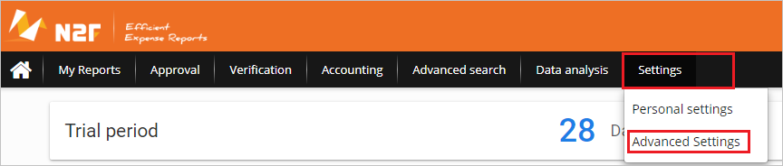
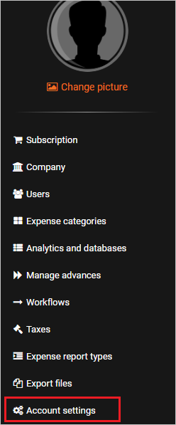
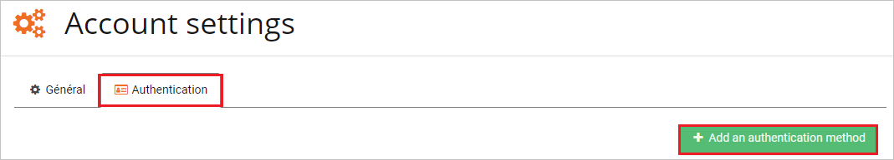
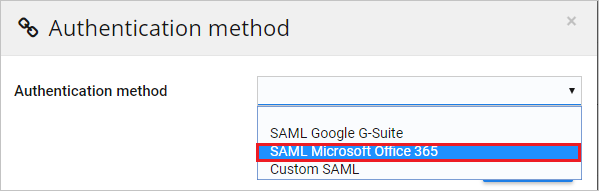
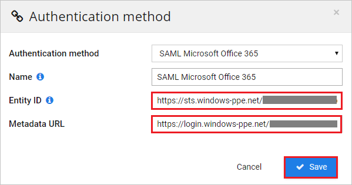

## Prerequisites

To configure Azure AD integration with N2F - Expense reports, you need the following items:

- An Azure AD subscription
- A N2F - Expense reports single sign-on enabled subscription

> **Note:**
> To test the steps in this tutorial, we do not recommend using a production environment.

To test the steps in this tutorial, you should follow these recommendations:

- Do not use your production environment, unless it is necessary.
- If you don't have an Azure AD trial environment, you can [get a one-month trial](https://azure.microsoft.com/pricing/free-trial/).

### Configuring N2F - Expense reports for single sign-on

1. In a different web browser window, sign in to your N2F - Expense reports company site as an administrator.

2. Click on **Settings** and then select **Advance Settings** from the dropdown.

	

3. Select **Account settings** tab.

	

4. Select **Authentication** and then select **+ Add an authentication method** tab.

	

5. Select **SAML Microsoft Office 365** as Authentication method.

	

6. On the **Authentication method** section, perform the following steps:

	

	a. In the **Entity ID** textbox, paste the **SAML Entity ID** value, which you have copied from the Azure portal.

	b. In the **Metadata URL** textbox, paste the **App Federation Metadata Url** value, which you have copied from the Azure portal.

	c. Click **Save**.

## Quick Reference

* **Azure AD Single Sign-On Service URL** : %metadata:singleSignOnServiceUrl%

## Additional Resources

* [How to integrate N2F - Expense reports with Azure Active Directory](https://docs.microsoft.com/azure/active-directory/saas-apps/n2f-expensereports-tutorial)
