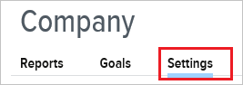
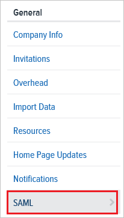
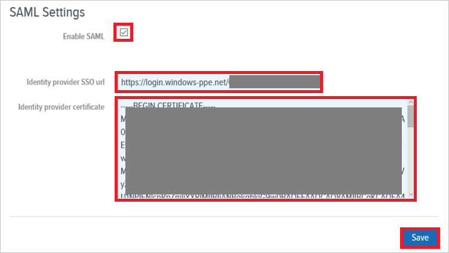

## Prerequisites

To configure Azure AD integration with Namely, you need the following items:

- An Azure AD subscription
- A Namely single sign-on enabled subscription

> **Note:**
> To test the steps in this tutorial, we do not recommend using a production environment.

To test the steps in this tutorial, you should follow these recommendations:

- Do not use your production environment, unless it is necessary.
- If you don't have an Azure AD trial environment, you can get a one-month trial [here](https://azure.microsoft.com/pricing/free-trial/).

### Configuring Namely for single sign-on

1. In another browser window, sign on to your Namely company site as an administrator.

2. In the toolbar on the top, click **Company**.
   
     

3. Click the **Settings** tab.
   
     

4. Click **SAML**.
   
     

5. On the **SAML Settings** page, perform the following steps:
   
    
 
    a. Click **Enable SAML**. 

    b. In the **Identity provider SSO url** textbox,  paste the value of **Azure AD Single Sign-On Service URL** : %metadata:singleSignOnServiceUrl%, which you have copied from Azure portal.
    
    c. Open your **[Downloaded Azure AD Signing Certifcate (Base64 encoded)](%metadata:certificateDownloadBase64Url%)** in Notepad, copy the content, and then paste it into the **Identity provider certificate** textbox.
     
    d. Click **Save**.

## Quick Reference

* **Azure AD Single Sign-On Service URL** : %metadata:singleSignOnServiceUrl%

* **[Download Azure AD Signing Certifcate (Base64 encoded)](%metadata:certificateDownloadBase64Url%)**

## Additional Resources

* [How to integrate Namely with Azure Active Directory](https://docs.microsoft.com/azure/active-directory/active-directory-saas-namely-tutorial)
