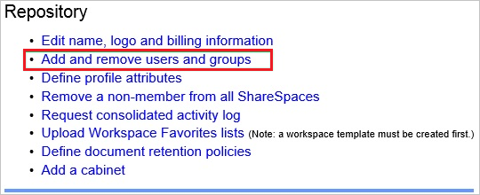
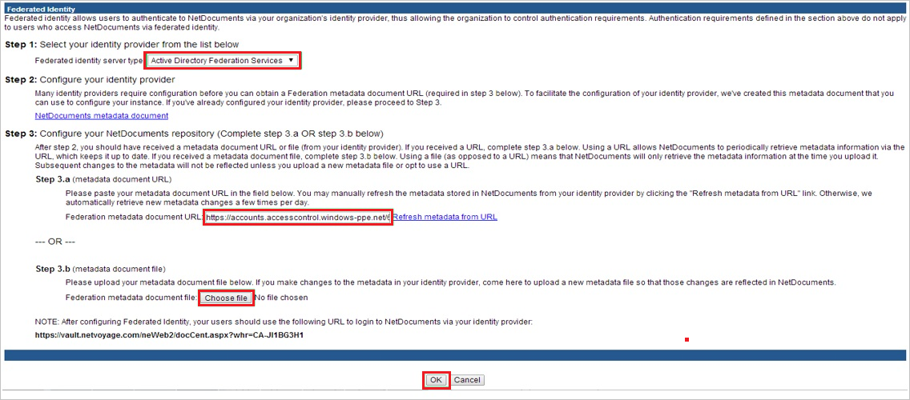

## Prerequisites

To configure Azure AD integration with NetDocuments, you need the following items:

- An Azure AD subscription
- A NetDocuments single sign-on enabled subscription

> **Note:**
> To test the steps in this tutorial, we do not recommend using a production environment.

To test the steps in this tutorial, you should follow these recommendations:

- Do not use your production environment, unless it is necessary.
- If you don't have an Azure AD trial environment, you can get a one-month trial [here](https://azure.microsoft.com/pricing/free-trial/).

### Configuring NetDocuments for single sign-on

1. In a different web browser window, log into your NetDocuments company site as an administrator.

2. Go to **Admin**.

3. Click **Add and remove users and groups**.
   
    

4. Click **Configure advanced authentication options**.
    
    

5. On the **Federated Identity** dialog, perform the following steps:
   
    
   
    a. As **Federated identity server type**, select **Active Directory Federation Services**.
   
    b. Click **Choose file**, to upload the downloaded [metadata file](%metadata:metadataDownloadUrl%) which you have downloaded from Azure portal.
   
    c. Click **OK**.

## Quick Reference

* **[Download SAML Metadata file](%metadata:metadataDownloadUrl%)**

## Additional Resources

* [How to integrate NetDocuments with Azure Active Directory](https://docs.microsoft.com/azure/active-directory/active-directory-saas-netdocuments-tutorial)
