## Prerequisites

To configure Azure AD integration with Netsuite, you need the following items:

- An Azure AD subscription
- A Netsuite single-sign on enabled subscription

> **Note:**
> To test the steps in this tutorial, we do not recommend using a production environment.

To test the steps in this tutorial, you should follow these recommendations:

- Do not use your production environment, unless it is necessary.
- If you don't have an Azure AD trial environment, you can get a one-month trial [here](https://azure.microsoft.com/pricing/free-trial/).

### Configuring Netsuite for single sign-on

1. Open a new tab in your browser, and sign into your Netsuite company site as an administrator.

2. In the toolbar at the top of the page, click **Setup**, then click **Setup Manager**.

   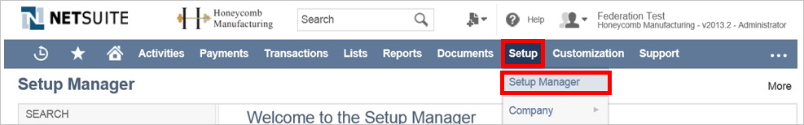

3. From the **Setup Tasks** list, select **Integration**.

	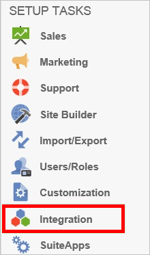

4. In the **Manage Authentication** section, click **SAML Single Sign-on**.

	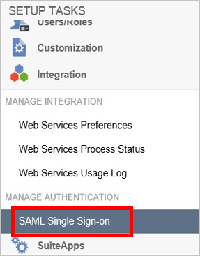

5. On the **SAML Setup** page, perform the following steps:
   
    a. Type **Azure AD Single Sign-On Service URL**: %metadata:singleSignOnServiceUrl% in the **Identity Provider Login Page** field in Netsuite.
  
   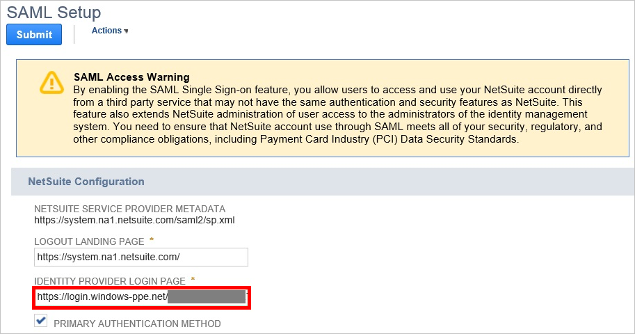
  
   b. In Netsuite, select **Primary Authentication Method**.

   c. For the field labeled **SAMLV2 Identity Provider Metadata**, select **Upload IDP Metadata File**. Then click **Browse** to upload the metadata file that you downloaded from Azure portal.

   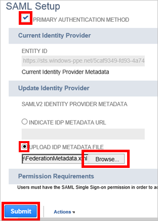

   d. Click **Submit**.

6. In Azure AD, Click **View and edit all other user attributes** check-box and add attribute.

7. For the **Attribute Name** field, type in `account`. For the **Attribute Value** field, type in your Netsuite account ID.This value is constant and change with account. Instructions on how to find your account ID are included below:

   a. In Netsuite, click **Setup** from the top navigation menu. 

   b. Then click under the **Setup Tasks** section of the left navigation menu, select the **Integration** section, and click **Web Services Preferences**.

   c. Copy your Netsuite Account ID and paste it into the **Attribute Value** field in Azure AD.

   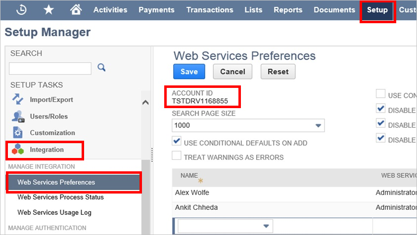

8. Before users can perform single sign-on into Netsuite, they must first be assigned the appropriate permissions in Netsuite. Follow the instructions below to assign these permissions.

   a. On the top navigation menu, click **Setup**, then click **Setup Manager**.
      
   

   b. On the left navigation menu, select **Users/Roles**, then click **Manage Roles**.
      
   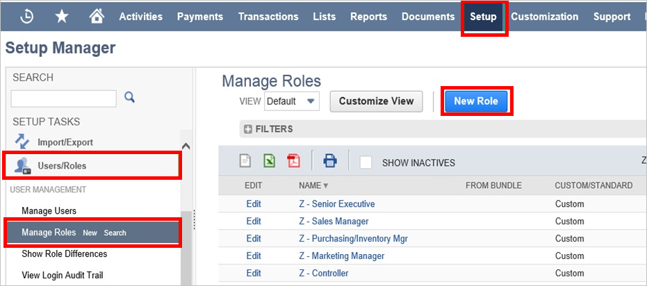

   c. Click **New Role**.

   d. Type in a **Name** for your new role, and select the **Single Sign-On Only** checkbox.
      
   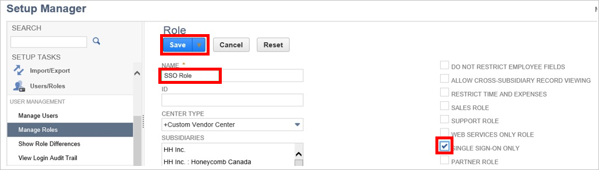

   e. Click **Save**.

   f. In the menu on the top, click **Permissions**. Then click **Setup**.
      
   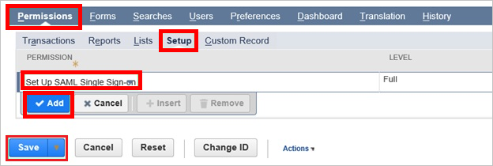

   g. Select **Set Up SAM Single Sign-on**, and then click **Add**. 

   h. Click **Save**.

   i. On the top navigation menu, click **Setup**, then click **Setup Manager**.
      
   

   j. On the left navigation menu, select **Users/Roles**, then click **Manage Users**.
      
   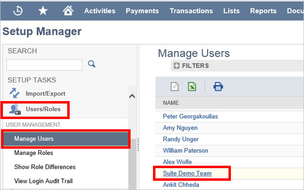

   k. Select a test user. Then click **Edit**.
      
   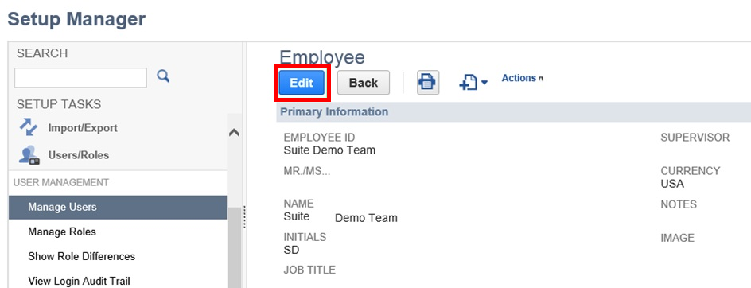

   l. On the Roles dialog, select the role that you have created and click **Add**.
      
   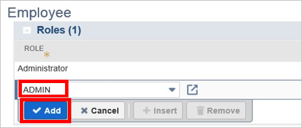

   m. Click **Save**.

## Quick Reference

* **Azure AD Single Sign-On Service URL**: %metadata:singleSignOnServiceUrl%

* **[Download SAML Metadata file](%metadata:metadataDownloadUrl%)**

## Additional Resources

* [How to integrate Netsuite with Azure Active Directory](https://docs.microsoft.com/en-us/azure/active-directory/active-directory-saas-netsuite-tutorial)
* [How to configure user provisioning with Netsuite](https://docs.microsoft.com/en-us/azure/active-directory/active-directory-saas-netsuite-provisioning-tutorial)
