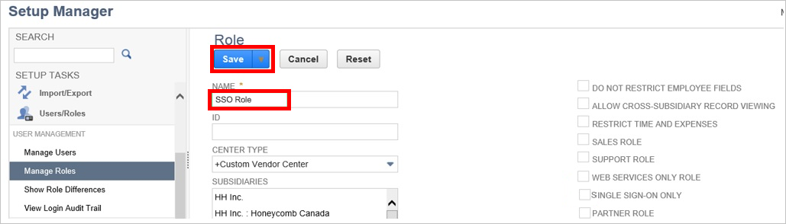

## Overview

To enable single sign-on with Netsuite, it must be configured to use Azure Active Directory as an identity provider. This guide provides information and tips on how to perform this configuration in Netsuite.

>[!Note:]
> This embedded guide is brand new in the new Azure portal, and we’d love to hear your thoughts. Use the Feedback ? button at the top of the portal to provide feedback. The older guide for using the [Azure classic portal](https://manage.windowsazure.com) to configure this application can be found [here](https://github.com/Azure/AzureAD-App-Docs/blob/master/articles/en-us/_/sso_configure.md).

## Prerequisites

To configure Azure AD integration with Netsuite, you need the following items:

- An Azure AD subscription
- A Netsuite single-sign on enabled subscription

> [!Note:]
> To test the steps in this tutorial, we do not recommend using a production environment.

To test the steps in this tutorial, you should follow these recommendations:

- You should not use your production environment, unless this is necessary.
- If you don't have an Azure AD trial environment, you can get an one-month trial [here](https://azure.microsoft.com/pricing/free-trial/).

### Configuring netsuite for single sign-on

1. Open a new tab in your browser, and sign into your Netsuite company site as an administrator.

2. In the toolbar at the top of the page, click **Setup**, then click **Setup Manager**.

    
3. From the **Setup Tasks** list, select **Integration**.

	
4. In the **Manage Authentication** section, click **SAML Single Sign-on**.

	
5. On the **SAML Setup** page, perform the following steps:
   
   * Copy the **SAML Single Sign-On Service URL** value from **Quick Reference** section of **Configure sign-on** and paste it into the **Identity Provider Login Page** field in Netsuite.
   
   * In Netsuite, select **Primary Authentication Method**.
   * For the field labeled **SAMLV2 Identity Provider Metadata**, select **Upload IDP Metadata File**. Then click **Browse** to upload the metadata file that you downloaded from Azure portal.
   
   

   * Click **Submit**.

6. In Azure AD, Click on **View and edit all other user attributes** check-box and add attribute.

    

7. For the **Attribute Name** field, type in `account`. For the **Attribute Value** field, type in your Netsuite account ID.This value is constant and change with account. Instructions on how to find your account ID are included below:

      

    * In Netsuite, click on **Setup** from the top navigation menu.
    * Then click under the **Setup Tasks** section of the left navigation menu, select the **Integration** section, and click on **Web Services Preferences**.
    * Copy your Netsuite Account ID and paste it into the **Attribute Value** field in Azure AD.

    
8. Before users can perform single sign-on into Netsuite, they must first be assigned the appropriate permissions in Netsuite. Follow the instructions below to assign these permissions.

    * On the top navigation menu, click **Setup**, then click **Setup Manager**.
      
        

    * On the left navigation menu, select **Users/Roles**, then click **Manage Roles**.
      
        

    * Click **New Role**.
    * Type in a **Name** for you new role, and select the **Single Sign-On Only** checkbox.
      
        

    * Click **Save**.
    * In the menu on the top, click **Permissions**. Then click **Setup**.
      
        

    * Select **Set Up SAM Single Sign-on**, and then click **Add**.
    * Click **Save**.
    * On the top navigation menu, click **Setup**, then click **Setup Manager**.
      
    

    * On the left navigation menu, select **Users/Roles**, then click **Manage Users**.
      
        

    * Select a test user. Then click **Edit**.
      
        

    * On the Roles dialog, select the role that you have created and click **Add**.
      
        

    * Click **Save**.

### Next steps

To ensure users can sign-in to Netsuite after it has been configured to use Azure Active Directory, review the following tasks and topics:

- User accounts must be pre-provisioned into Netsuite prior to sign-in. To set this up, see Provisioning.
 
- Users must be assigned access to Netsuite in Azure AD to sign-in. To assign users, see Users.
 
- To configure access polices for Netsuite users, see Access Policies.
 
- For additional information on deploying single sign-on to users, see [this article](https://docs.microsoft.com/en-us/azure/active-directory/active-directory-appssoaccess-whatis#deploying-azure-ad-integrated-applications-to-users).

## Quick Reference
 
* **Azure AD Single Sign-On Service URL** : %metadata:singleSignOnServiceUrl%
 
* **Azure AD Sign Out URL** : %metadata:singleSignOutServiceUrl%
 
* **Azure AD SMAL Entity ID** : %metadata:IssuerUri%
 
* **[Download Azure AD Signing Certifcate (Base64 encoded)](%metadata:certificateDownloadBase64Url%)**

