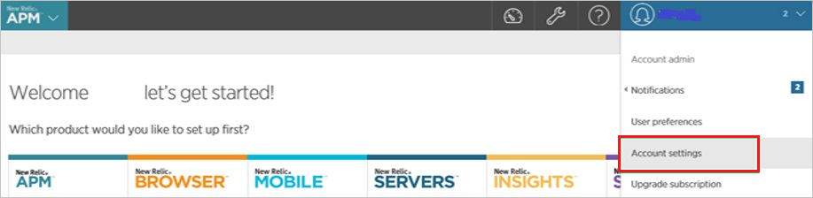
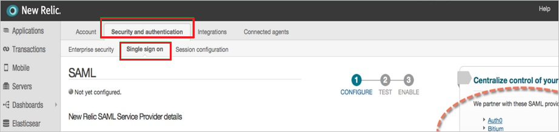
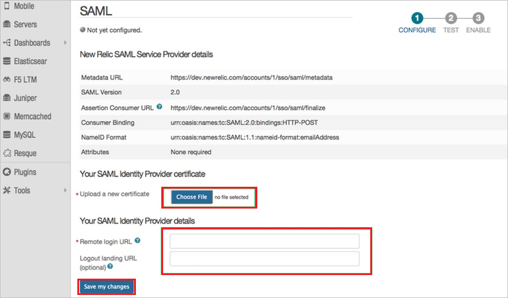

## Prerequisites

To configure Azure AD integration with New Relic, you need the following items:

- An Azure AD subscription
- A New Relic single sign-on enabled subscription

> **Note:**
> To test the steps in this tutorial, we do not recommend using a production environment.

To test the steps in this tutorial, you should follow these recommendations:

- Do not use your production environment, unless it is necessary.
- If you don't have an Azure AD trial environment, you can [get a one-month trial](https://azure.microsoft.com/pricing/free-trial/).

### Configuring New Relic for single sign-on

1. In a different web browser window, sign on to your **New Relic** company site as administrator.

2. In the menu on the top, click **Account Settings**.
   
    

3. Click the **Security and authentication** tab, and then click the **Single sign on** tab.
   
    

4. On the SAML dialog page, perform the following steps:
   
    
   
   a. Click **Choose File** to upload your **[Downloaded Azure AD Signing Certifcate (Base64 encoded)](%metadata:certificateDownloadBase64Url%)**.

   b. In the **Remote login URL** textbox,  paste the value of **Azure AD Single Sign-On Service URL** : %metadata:singleSignOnServiceUrl%, which you have copied from Azure portal.
   
   c. In the **Logout landing URL** textbox, paste the value of **Azure AD Sign Out URL** : %metadata:singleSignOutServiceUrl%, which you have copied from Azure portal.

   d. Click **Save my changes**.

## Quick Reference

* **Azure AD Single Sign-On Service URL** : %metadata:singleSignOnServiceUrl%

* **Azure AD Sign Out URL** : %metadata:singleSignOutServiceUrl%

* **[Download Azure AD Signing Certifcate (Base64 encoded)](%metadata:certificateDownloadBase64Url%)**

## Additional Resources

* [How to integrate New Relic with Azure Active Directory](https://docs.microsoft.com/azure/active-directory/active-directory-saas-new-relic-tutorial)
